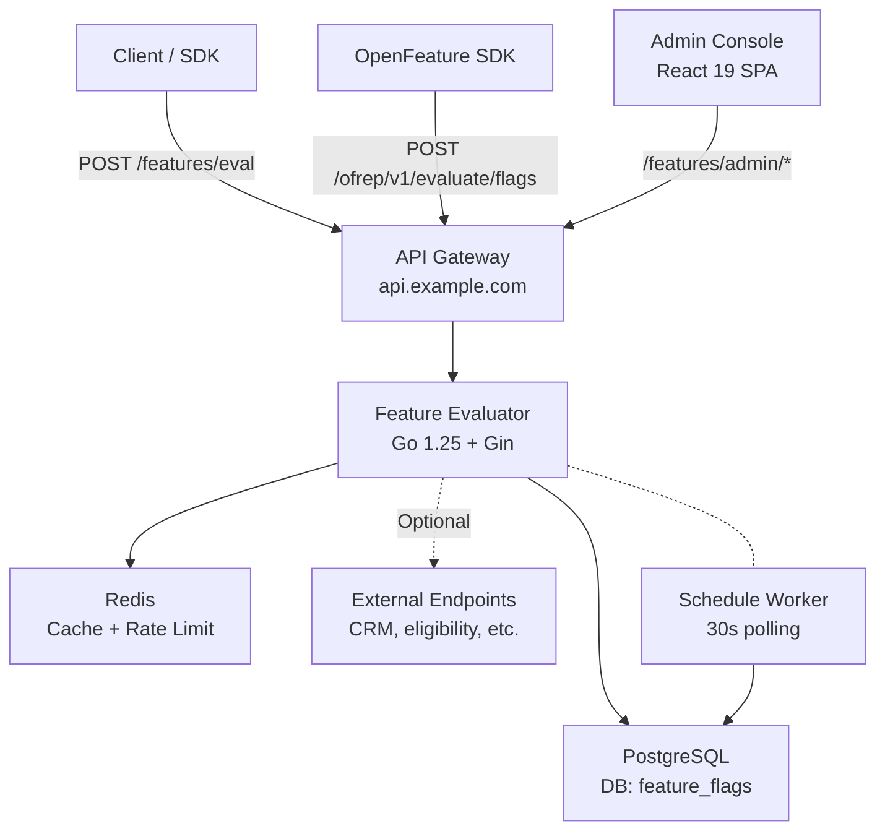

# Feature Evaluator

Advanced feature flag evaluation engine with expression-based rules, massive segment targeting, external endpoint validation, and feature packs. Full-featured platform for progressive delivery, experimentation, and multi-workspace feature management.

## Key Features

- **Expression-based rules** -- Boolean logic, string ops, array functions, segment membership via [expr-lang](https://expr-lang.org)
- **Percentage rollouts** -- Gradual feature releases with deterministic, monotonic user bucketing (FNV-1a hash)
- **A/B testing & experimentation** -- Full experiment lifecycle (draft/running/paused/completed) with variant assignment, exposure tracking, conversion reporting, and Wilson score confidence intervals
- **Scheduled rollouts** -- Program future feature changes (toggles, default values, environments, updates) with automatic execution via background worker
- **Change history** -- Immutable audit trail recording all admin operations with field-level diffs
- **Multi-workspace** -- Complete workspace isolation for all entities with `X-Workspace` header (defaults to "default")
- **OFREP compatible** -- OpenFeature Remote Evaluation Protocol endpoints for vendor-agnostic SDK integration
- **Massive segments** -- Import thousands of users via CSV, with tenant-scoped membership and TTL expiration
- **External validation** -- HTTP callouts during evaluation with circuit breaker, caching, and fail-open/closed modes
- **Feature packs** -- Bundle multiple features into packs with tenant/campus/program-level activations
- **Multi-tenant scoping** -- Rules scoped by tenant, campus, and program hierarchy
- **Enriched responses** -- Returns value + matched rule + segment memberships + metadata + reason
- **Admin console** -- Full-featured React 19 SPA for managing features, rules, segments, packs, experiments, schedules, workspaces, and team members

## Tech Stack

| Layer       | Technology                                                                          |
| ----------- | ----------------------------------------------------------------------------------- |
| Backend     | Go 1.25, Gin, PostgreSQL, Redis                                                  |
| Rule Engine | [expr-lang/expr](https://github.com/expr-lang/expr) (compiled bytecode, LRU cached) |
| Frontend    | React 19, Vite 7, TypeScript 5.9, TanStack Router, TanStack Query                   |
| UI          | Tailwind CSS v4, shadcn/ui, OKLCH theming                                           |
| Auth        | OIDC (generic provider), PKCE S256                                                  |
| State       | Zustand (client), TanStack Query (server)                                           |
| i18n        | react-i18next (ES default, EN secondary)                                            |

## Quick Start

```bash
# 1. Ensure PostgreSQL is already running locally and matches DATABASE_URL

# 2. Start Redis
make redis

# 3. Ensure server/.env includes DATABASE_URL, REDIS_URI, and AUTH_SECRETS_MASTER_KEY

# 4. Start backend (port 8080)
make server

# 5. Start frontend (port 5173)
make console
```

> **Note:** For local development, auth is disabled by default (`AUTH_DISABLED=true`). A mock user with `owner` role is injected automatically.
>
> **Required for startup:** `DATABASE_URL`, `REDIS_URI`, and `AUTH_SECRETS_MASTER_KEY` must be present in `server/.env`. The backend runs a startup preflight and fails fast when PostgreSQL or Redis are unreachable.

## Auth Profile Secret Key

`AUTH_SECRETS_MASTER_KEY` is a base64-encoded 32-byte AES key used to encrypt:

- `AuthProfile` secret payloads persisted in PostgreSQL
- inline API keys used by rule-level external validation

Generate a key with:

```bash
openssl rand -base64 32
```

Then place it in `server/.env`:

```bash
AUTH_SECRETS_MASTER_KEY=your-generated-base64-key
```

`make server` and `make dev` load `server/.env` directly. `server/.env.example` includes the expected format and a valid development value.

## Evaluation Auth Model

`AuthProfile` now defines how a feature validates the incoming request sent to `/features/eval`.

Operational split:

- `Feature.accessPolicy` decides whether the feature is public, optional, or requires auth.
- `Feature.authProfileKey` selects the reusable inbound auth profile used by that feature.
- `AuthProfile` validates the incoming request.
- `externalValidation` remains rule-level logic for optional business callouts during evaluation.

Supported `AuthProfile` types:

- `api_key`
  Validates a fixed secret from a configurable header or query param. No external call is made.
- `oidc_standard`
  Validates the incoming bearer token against an external OIDC provider using discovery and JWKS.
- `custom`
  Calls an external validator with mappings from request headers or request body JSON paths.

At runtime, rule-level external validation can still read both feature context and incoming request input. Typical placeholders are:

- `{{user.id}}`
- `{{context.user.id}}`
- `{{input.headers.authorization}}`
- `{{input.auth.bearerToken}}`
- `{{input.auth.apiKey}}`

Default external-validation success rule:

- if `responseCondition` is empty, any `2xx` response means allow;
- any non-`2xx` response means block;
- network errors, timeouts, or open circuit breaker still use `failMode`.

The guided external-validation builder can also generate:

- `response.authorized == true`
- `http.headers["x-decision"] == "allow"`
- `responseText contains "ok"`

For the backend contract and type-by-type guidance, see [server/README.md](server/README.md).

## Architecture



## Directory Structure

```
feature-evaluator/
├── server/                     # Go backend (independent module)
│   ├── cmd/server/main.go
│   ├── internal/
│   │   ├── config/             # Env-based configuration (Viper)
│   │   ├── server/middleware/  # Auth, authz, tenant, workspace, CORS, rate limit, logging
│   │   ├── domain/             # Clean architecture: models + interfaces
│   │   │   ├── feature/        # Feature CRUD + rules + rollout salt
│   │   │   ├── segment/        # Segment + member management
│   │   │   ├── member/         # Team members + RBAC
│   │   │   ├── evaluation/     # Eval orchestration + rollout bucketing + experiment override
│   │   │   ├── pack/           # Feature packs + activations
│   │   │   ├── apikey/         # Admin API key management
│   │   │   ├── tag/            # Feature tags with colors
│   │   │   ├── metrics/        # Runtime metrics collection
│   │   │   ├── audit/          # Eval error logging
│   │   │   ├── changelog/      # Immutable change history (audit trail)
│   │   │   ├── workspace/      # Multi-workspace isolation
│   │   │   ├── schedule/       # Scheduled rollouts + background worker
│   │   │   └── experiment/     # A/B testing: experiments, exposures, conversions
│   │   ├── engine/             # Rule engine: compile, cache, evaluate
│   │   ├── external/           # HTTP callout + circuit breaker
│   │   ├── storage/            # PostgreSQL + Redis implementations
│   │   ├── handler/            # HTTP handlers (incl. OFREP)
│   │   └── dto/                # Request/response DTOs + mappers (incl. OFREP)
│   └── pkg/apierror/           # Structured API error types
├── console/                    # React frontend (independent node project)
│   ├── src/
│   │   ├── config/             # Env, OIDC, query client
│   │   ├── api/                # API client layer
│   │   ├── auth/               # OIDC provider, guards, roles
│   │   ├── components/         # ui/ layout/ features/ rules/ segments/ packs/ experiments/ settings/ shared/
│   │   ├── hooks/              # useAuth, usePermissions, etc.
│   │   ├── stores/             # Zustand (theme, sidebar, locale, workspace)
│   │   ├── queries/            # TanStack Query definitions
│   │   ├── mutations/          # TanStack Query mutations
│   │   ├── i18n/               # Internationalization config
│   │   └── routes/             # TanStack Router (file-based)
│   └── public/locales/         # Translation files (es, en)
├── docs/                       # Project documentation
│   ├── architecture.md         # System design and data flow
│   ├── api-reference.md        # Full API endpoint reference
│   ├── configuration.md        # Environment variables and setup
│   ├── rule-engine.md          # Expression language guide
│   └── deployment.md           # Docker and production deployment
├── docker-compose.yml          # Redis only
├── Makefile                    # All dev commands
└── CLAUDE.md                   # AI-assisted development context
```

## Documentation

| Document                                | Description                             |
| --------------------------------------- | --------------------------------------- |
| [Architecture](docs/architecture.md)    | System design, data flow, caching       |
| [API Reference](docs/api-reference.md)  | Full endpoint reference with examples   |
| [Configuration](docs/configuration.md)  | Environment variables and setup guide   |
| [Rule Engine](docs/rule-engine.md)      | Expression language and custom functions |
| [Deployment](docs/deployment.md)        | Docker, production, and CI/CD           |
| [UI Flows](docs/UI-FLOW.md)            | Admin console screen flows              |

## Commands

| Command          | Description                                     |
| ---------------- | ----------------------------------------------- |
| `make dev`       | Start backend + frontend (PostgreSQL and Redis must already be available locally) |
| `make server`    | Run Go backend on port 8080 with startup preflight for PostgreSQL and Redis        |
| `make console`   | Run React frontend on port 5173                 |
| `make redis`     | Start Redis via Docker Compose                  |
| `make lint`      | Run all linters (Go + ESLint)                   |
| `make test`      | Run all tests (Go + React)                      |
| `make quality`   | Full CI gate: lint + test + typecheck           |
| `make format`    | Format all code (gofmt + goimports + Prettier)  |
| `make typecheck` | TypeScript type checking (tsc --noEmit)         |

## API Overview

### Base Paths

| Base Path | Purpose |
|-----------|---------|
| `/features` | Native evaluation + admin API |
| `/ofrep/v1` | OpenFeature Remote Evaluation Protocol |

### Evaluation API

Evaluation auth is feature-specific:

- `public` features can be called without credentials
- `required` features must receive whatever credential the bound `AuthProfile` expects
- `optional` features allow anonymous requests, but reject invalid credentials when credentials are sent

```bash
# Single evaluation for a public feature
curl -X POST http://localhost:8080/features/eval \
  -H "Content-Type: application/json" \
  -H "X-Tenant-Id: cl" \
  -d '{
    "featureKey": "checkout-v2",
    "context": {
      "user": {"id": "u-123", "plan": "enterprise"}
    }
  }'

# Single evaluation for a feature protected by an API-key Auth Profile
curl -X POST http://localhost:8080/features/eval \
  -H "Content-Type: application/json" \
  -H "X-Student-Key: demo-key" \
  -d '{
    "featureKey": "library-access",
    "context": {
      "user": {"id": "u-123"}
    }
  }'

# Single evaluation for a feature protected by an OAuth2 passthrough profile
curl -X POST http://localhost:8080/features/eval \
  -H "Content-Type: application/json" \
  -H "Authorization: Bearer eyJ..." \
  -d '{
    "featureKey": "checkout-v2",
    "context": {
      "user": {"id": "u-123"}
    }
  }'

# Bulk evaluation
curl -X POST http://localhost:8080/features/eval/bulk \
  -H "Content-Type: application/json" \
  -d '{"features": [{"featureKey": "checkout-v2", "context": {"user": {"id": "u-123"}}}]}'

# Evaluate all active features
curl -X POST http://localhost:8080/features/eval/active \
  -H "Content-Type: application/json" \
  -d '{"context": {"user": {"id": "u-123"}}, "environment": "production"}'

# Report a conversion (A/B testing)
curl -X POST http://localhost:8080/features/eval/conversions \
  -H "Content-Type: application/json" \
  -d '{"experimentId": "...", "userId": "u-123", "metricKey": "signup", "value": 1}'
```

### OFREP API (OpenFeature Remote Evaluation Protocol)

Standard OFREP endpoints for vendor-agnostic SDK integration. Auth works the same way as `/features/eval`: it depends on each feature's `accessPolicy` and bound `AuthProfile`.

```bash
# Single flag evaluation
curl -X POST http://localhost:8080/ofrep/v1/evaluate/flags/checkout-v2 \
  -H "Content-Type: application/json" \
  -H "Authorization: Bearer eyJ..." \
  -d '{
    "context": {
      "targetingKey": "u-123",
      "tenantId": "cl",
      "plan": "enterprise"
    }
  }'

# Response:
# {
#   "key": "checkout-v2",
#   "value": true,
#   "variant": "beta-users",
#   "reason": "TARGETING_MATCH",
#   "metadata": {}
# }

# Bulk evaluation (with ETag support)
curl -X POST http://localhost:8080/ofrep/v1/evaluate/flags \
  -H "Content-Type: application/json" \
  -d '{"context": {"targetingKey": "u-123"}}'

# Returns ETag header; send If-None-Match for 304 Not Modified
```

**OFREP context mapping:** Flat OFREP context is automatically mapped to the internal namespaced format: `targetingKey` becomes `user.id`, `tenantId` becomes `tenant.id`, `campusId` becomes `campus.id`, `programId` becomes `program.id`. All other flat keys go under the `user` namespace. Pre-namespaced (nested) contexts are also accepted.

**OFREP reason mapping:** `TARGETING_MATCH` (matched rule), `STATIC` (default value), `SPLIT` (experiment), `DISABLED` (feature disabled/inactive/expired/env mismatch).

### Admin API

Requires `Authorization: Bearer <oidc-token>` or admin API key. Role-based access (Owner > Admin > Editor > Viewer).

See [API Reference](docs/api-reference.md) for the full endpoint list.

### API Routes Summary

| Group | Auth | Key Routes |
|-------|------|------------|
| Health | none | `GET /features/healthz`, `GET /features/readyz` |
| Eval | Bearer or X-Api-Key | `POST /features/eval`, `/eval/bulk`, `/eval/active`, `/eval/conversions` |
| OFREP | Feature auth profile / anonymous | `POST /ofrep/v1/evaluate/flags/:key`, `POST /ofrep/v1/evaluate/flags` |
| Features | Bearer JWT (admin) | `GET/POST/PUT/DELETE /features/admin/features`, `PATCH .../toggle` |
| Rules | Bearer JWT (admin) | `GET/POST/PUT/DELETE /features/admin/features/:key/rules`, `PUT .../reorder` |
| Schedules | Bearer JWT (admin) | `POST/GET /features/admin/features/:key/schedules`, `DELETE /features/admin/schedules/:id` |
| Experiments | Bearer JWT (admin) | `GET/POST/PUT /features/admin/experiments`, `POST .../:id/{start,pause,complete,declare-winner}` |
| Packs | Bearer JWT (admin) | `GET/POST/PUT/DELETE /features/admin/packs`, `PATCH .../toggle`, `POST/DELETE .../activate` |
| Segments | Bearer JWT (admin) | `GET/POST/PUT/DELETE /features/admin/segments`, `POST .../members/import` |
| Changelog | Bearer JWT (admin) | `GET /features/admin/changelog`, `GET /features/admin/changelog/:entityType/:entityKey` |
| Workspaces | Bearer JWT (owner for mutations) | `GET /features/admin/workspaces`, `POST /features/admin/workspaces`, `PUT /features/admin/workspaces/:key`, `POST /features/admin/workspaces/:key/{archive,restore}`, `DELETE /features/admin/workspaces/:key` |
| Members | Bearer JWT (admin) | `GET/POST/PUT/DELETE /features/admin/members`, `POST .../transfer-ownership` |
| API Keys | Bearer JWT (admin) | `POST/GET /features/admin/api-keys`, `PUT .../rotate`, `DELETE ...` |
| Tags | Bearer JWT (admin) | `GET/POST/PUT/DELETE /features/admin/tags` |
| Dashboard | Bearer JWT (admin) | `GET /features/admin/dashboard/{stats,activity,error-summary}` |
| Metrics | Bearer JWT (admin) | `GET /features/admin/dashboard/metrics/{overview,features,reasons,...}` |
| Audit | Bearer JWT (admin) | `GET /features/admin/audit/errors` |

## Roles & Permissions

| Permission           | Owner | Admin | Editor | Viewer |
| -------------------- | :---: | :---: | :----: | :----: |
| features.read        |   Y   |   Y   |   Y    |   Y    |
| features.write       |   Y   |   Y   |   Y    |   -    |
| segments.read        |   Y   |   Y   |   Y    |   Y    |
| segments.write       |   Y   |   Y   |   Y    |   -    |
| packs.read           |   Y   |   Y   |   Y    |   Y    |
| packs.write          |   Y   |   Y   |   Y    |   -    |
| experiments.read     |   Y   |   Y   |   Y    |   Y    |
| experiments.write    |   Y   |   Y   |   Y    |   -    |
| members.read         |   Y   |   Y   |   Y    |   Y    |
| members.manage       |   Y   |   Y   |   -    |   -    |
| settings.manage      |   Y   |   Y   |   -    |   -    |
| audit.read           |   Y   |   Y   |   Y    |   Y    |
| workspace.delete     |   Y   |   -   |   -    |   -    |
| ownership.transfer   |   Y   |   -   |   -    |   -    |

## New Features in Detail

### Percentage Rollouts

Each rule can have a `rolloutPercentage` (0-100). When set, only the given percentage of users see the rule's value. Bucketing uses FNV-1a hash over `featureKey + rolloutSalt + userId`, producing deterministic and monotonic assignment (increasing the percentage never excludes previously included users). Features auto-generate a `rolloutSalt` (16-byte hex via `crypto/rand`) on creation.

### Change History (Audit Trail)

All admin operations (create, update, delete, toggle) on features, rules, segments, packs, and experiments are recorded in an immutable `changelog` table. Each entry includes field-level diffs (old vs new values), the actor identity, and actor type (`user`, `apikey`, or `system`). Writes are fire-and-forget via goroutine to avoid impacting request latency.

Endpoints:
- `GET /features/admin/changelog` -- list all changes (filterable by entityType, action, actor, date range)
- `GET /features/admin/changelog/:entityType/:entityKey` -- changes for a specific entity

### Multi-Workspace

All entities (features, segments, packs, tags, API keys, experiments, schedules) are scoped to a workspace. The workspace is determined by the `X-Workspace` request header; if omitted, it defaults to `"default"` for backward compatibility. Feature keys can repeat across workspaces. Existing data is migrated automatically to the `"default"` workspace.

Workspace lifecycle is owner-controlled. Read routes are `GET /features/admin/workspaces` and `GET /features/admin/workspaces/:key`; mutations use `POST /features/admin/workspaces`, `PUT /features/admin/workspaces/:key`, `POST /features/admin/workspaces/:key/archive`, and `POST /features/admin/workspaces/:key/restore`. `DELETE /features/admin/workspaces/:key` is kept as a backward-compatible archive alias.

### Scheduled Rollouts

Schedule future changes to features (toggle, default value, environment, and general feature updates). A background worker polls every 30 seconds, claiming pending schedules via `SELECT ... FOR UPDATE SKIP LOCKED` to guarantee single execution across multiple instances. Failed executions are marked with `status: "failed"` and the error message. Executed changes are recorded in the changelog with `actorType: "system"`.

Endpoints:
- `POST /features/admin/features/:key/schedules` -- create a scheduled change
- `GET /features/admin/features/:key/schedules` -- list schedules for a feature
- `DELETE /features/admin/schedules/:id` -- cancel a pending schedule

### A/B Testing & Experimentation

Full experiment lifecycle: **draft** (configure) -> **running** (collecting data) -> **paused** (optional) -> **completed**. Each experiment defines 2-4 variants with weights summing to 100%. Users are deterministically assigned to variants using FNV-1a hashing. While an experiment is running, it overrides the feature's normal rules and rollout.

Exposures are recorded automatically on evaluation. Clients report conversions via `POST /features/eval/conversions`. Results include per-variant conversion rates with Wilson score confidence intervals. Declaring a winner updates the feature's `defaultValue` to the winning variant's value. Active experiments are cached in Redis (60s TTL).

Endpoints:
- `POST/GET /features/admin/experiments` -- CRUD
- `POST /features/admin/experiments/:id/{start,pause,complete}` -- lifecycle transitions
- `POST /features/admin/experiments/:id/declare-winner` -- apply winner
- `GET /features/admin/experiments/:id/results` -- statistical results

## PostgreSQL Tables

| Table | Purpose | Key indexes |
|-------|---------|-------------|
| `features` | Feature flags | unique `key` + `workspaceKey` |
| `feature_rules` | Feature rules | feature + priority |
| `feature_tags` | Feature-tag relations | feature + tag |
| `segments` | User segments | unique `key` + `workspaceKey` |
| `segment_records` | Segment membership records | segment + version + record key |
| `packs` | Feature bundles | unique `key` + `workspaceKey` |
| `pack_features` | Pack-feature relations | pack + feature |
| `pack_activations` | Pack target activations | compound |
| `members` | Team members + roles | unique email + `workspaceKey` |
| `api_keys` | Eval + admin API keys | unique prefix |
| `tags` | Feature tags | unique `key` + `workspaceKey` |
| `evaluation_errors` | Evaluation error log | feature + createdAt |
| `changelog` | Immutable change history | entityType+entityKey, actor, createdAt, workspaceKey |
| `workspaces` | Workspace definitions | unique `key` |
| `schedules` | Future feature changes | status+scheduledAt, featureKey, workspaceKey |
| `experiments` | A/B test definitions | feature + status + workspace |
| `experiment_exposures` | Experiment user exposures | unique experimentId+userId |
| `experiment_conversions` | Experiment conversion events | unique experimentId+userId+metricKey |

## License

MIT -- see [LICENSE](LICENSE)
