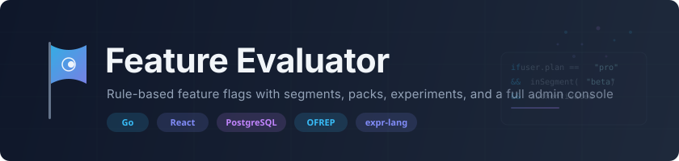
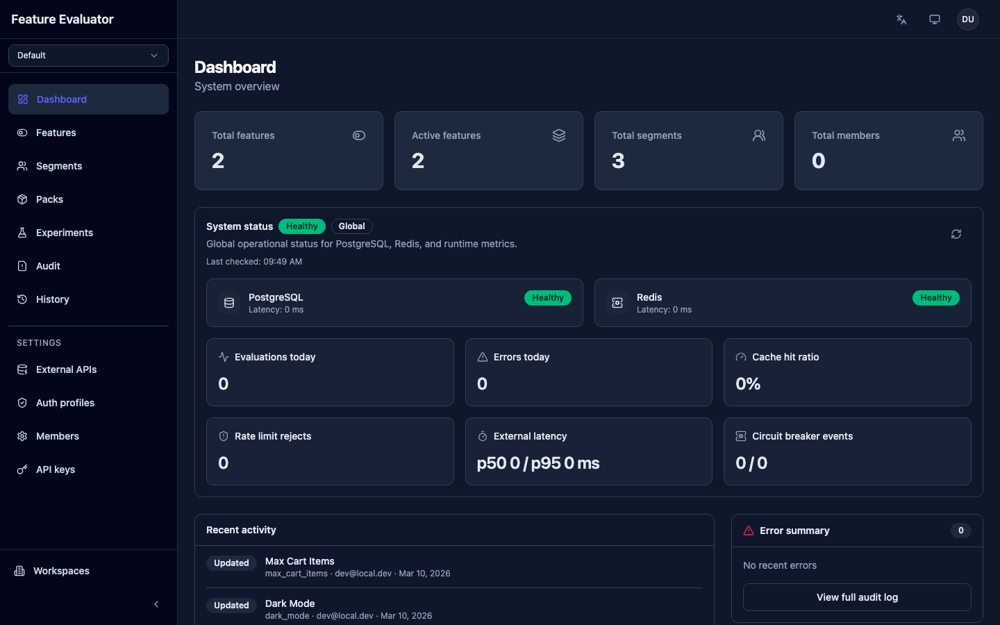
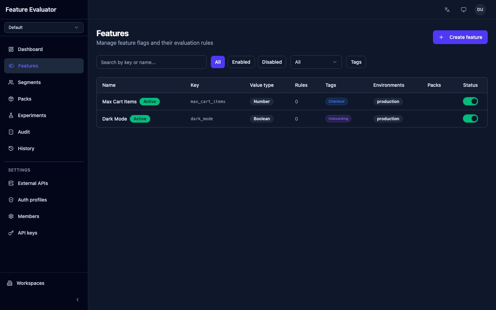
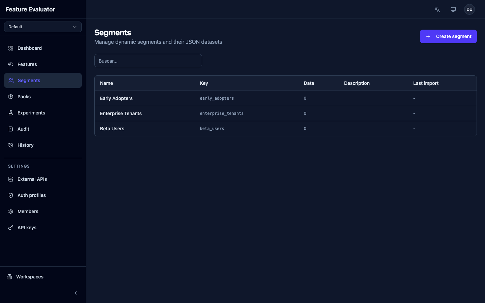
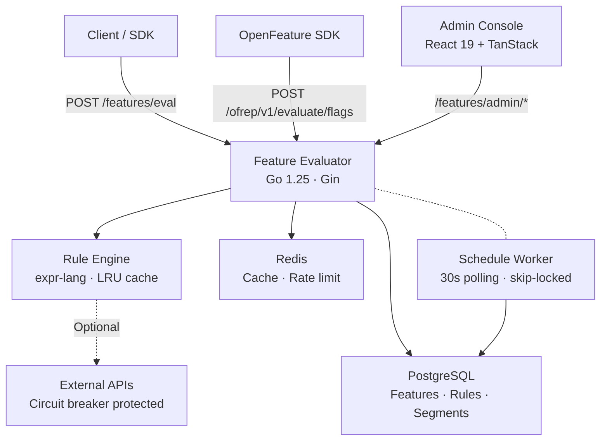
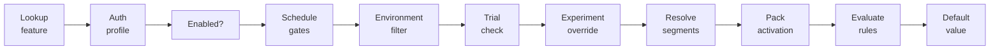

<p align="center">
  <picture>
    <source media="(prefers-color-scheme: dark)" srcset="docs/assets/branding/hero-banner.svg">
    <source media="(prefers-color-scheme: light)" srcset="docs/assets/branding/hero-banner.svg">
    
  </picture>
</p>

<p align="center">
  <a href="https://go.dev/"></a>
  <a href="https://react.dev/"></a>
  <a href="https://openfeature.dev/specification/appendix-c-ofrep/"></a>
  <a href="LICENSE"></a>
</p>

<p align="center">
  Self-hosted feature flag platform with expression-based rules, user segments, feature packs,<br>
  A/B experiments, and a full admin console. Built for teams that need fine-grained control<br>
  over progressive delivery without vendor lock-in.
</p>

<p align="center">
  <a href="#quick-start">Quick Start</a> ·
  <a href="#key-features">Features</a> ·
  <a href="#architecture">Architecture</a> ·
  <a href="#api-usage">API Usage</a> ·
  <a href="docs/api-reference.md">API Reference</a> ·
  <a href="docs/deployment.md">Deployment</a>
</p>

---

## Admin Console

<p align="center">
  
</p>

<details>
<summary><strong>More screenshots</strong></summary>
<br>

**Feature list** — search, filter by status/type/tag/environment, toggle features inline



**Segments** — user segment management with CSV import and tenant-scoped membership



</details>

## Key Features

**Evaluation Engine**

- Expression-based rules powered by [expr-lang](https://github.com/expr-lang/expr) with compiled bytecode and LRU cache
- Percentage rollouts with deterministic, monotonic user bucketing (FNV-1a)
- Multi-environment targeting (dev, staging, production)
- [OFREP](https://openfeature.dev/specification/appendix-c-ofrep/) compatible for vendor-agnostic SDK integration

**Segments & Targeting**

- Import thousands of users via CSV with tenant-scoped membership
- Use `inSegment("beta-users")` directly in rule expressions
- Batch segment resolution — pre-scans all rules, resolves memberships in one pass

**Feature Packs**

- Bundle features into packs and activate per tenant, campus, or program
- Pack inheritance chains and tier-based feature gating
- Trial periods with automatic expiration

**Experimentation**

- Full A/B test lifecycle: draft → running → paused → completed
- Deterministic variant assignment, exposure tracking, conversion reporting
- Wilson score confidence intervals for statistical results

**Admin Console**

- React 19 SPA with dark/light theme and i18n (Spanish default, English)
- RBAC with 4 roles: Owner, Admin, Editor, Viewer
- Multi-workspace isolation — all entities scoped per workspace

**Operations**

- Scheduled rollouts — program future changes with background worker execution
- Immutable change history with field-level diffs and actor tracking
- External HTTP validation per rule with circuit breakers (fail-open/closed)
- Rate limiting and Redis caching (fail-open design)

## Architecture



### Evaluation Pipeline



> Rules are evaluated by priority (ascending). First match wins. Each rule can have rollout percentage, external API bindings, and source bindings. If no rule matches, the feature's `defaultValue` is returned.

## Tech Stack

| Layer       | Technology                                                                                   |
| ----------- | -------------------------------------------------------------------------------------------- |
| Backend     | Go 1.25, Gin, PostgreSQL (pgx/v5), Redis                                                     |
| Rule Engine | [expr-lang/expr](https://github.com/expr-lang/expr) — compiled bytecode, 10K-entry LRU cache |
| Frontend    | React 19, Vite 7, TypeScript 5.9, TanStack Router + Query                                    |
| UI          | Tailwind CSS v4, shadcn/ui, Radix UI, OKLCH theming                                          |
| Auth        | OIDC (any provider), PKCE S256, API keys                                                     |
| State       | Zustand (client), TanStack Query (server)                                                    |
| i18n        | react-i18next — Spanish (default), English                                                   |
| Protocol    | OFREP (OpenFeature Remote Evaluation Protocol)                                               |

## Quick Start

**Prerequisites:** Go 1.25+, Node 22+, pnpm, PostgreSQL, Docker

```bash
# 1. Start Redis
make redis

# 2. Configure backend (copy and edit server/.env)
cp server/.env.example server/.env
# Set DATABASE_URL, REDIS_URI, and generate AUTH_SECRETS_MASTER_KEY:
#   openssl rand -base64 32

# 3. Start backend (port 8080) + frontend (port 5173)
make dev
```

> **Dev mode:** Auth is disabled by default (`AUTH_DISABLED=true`). A mock user with `owner` role is injected automatically. The backend runs a preflight check and fails fast if PostgreSQL or Redis are unreachable.

## API Usage

### Single Feature Evaluation

```bash
curl -X POST http://localhost:8080/features/eval \
  -H "Content-Type: application/json" \
  -d '{
    "featureKey": "checkout-v2",
    "context": {
      "user": { "id": "u-123", "plan": "enterprise" },
      "tenant": { "id": "acme-corp" }
    },
    "environment": "production"
  }'
```

```jsonc
// Response
{
  "featureKey": "checkout-v2",
  "value": true,
  "valueType": "boolean",
  "reason": "matched_rule",
  "matchedRule": { "name": "Enterprise users", "priority": 0 },
  "segments": [{ "key": "beta-users", "isMember": true }],
  "evaluatedAt": "2026-03-10T12:00:00Z",
}
```

### Bulk Evaluation

```bash
curl -X POST http://localhost:8080/features/eval/bulk \
  -H "Content-Type: application/json" \
  -d '{
    "features": [
      { "featureKey": "checkout-v2", "context": { "user": { "id": "u-123" } } },
      { "featureKey": "dark-mode", "context": { "user": { "id": "u-123" } } }
    ]
  }'
```

### OFREP (OpenFeature)

```bash
curl -X POST http://localhost:8080/ofrep/v1/evaluate/flags/checkout-v2 \
  -H "Content-Type: application/json" \
  -d '{ "context": { "targetingKey": "u-123", "tenantId": "acme-corp" } }'
```

> OFREP flat context is auto-mapped: `targetingKey` → `user.id`, `tenantId` → `tenant.id`. See [API Reference](docs/api-reference.md) for all endpoints.

## Expression Engine

Rules use [expr-lang](https://github.com/expr-lang/expr) expressions with these built-in variables and functions:

| Context             | Available Fields                                              |
| ------------------- | ------------------------------------------------------------- |
| `user`              | `user.id`, `user.plan`, `user.email`, ... (from eval context) |
| `tenant`            | `tenant.id`, `tenant.name`, ...                               |
| `campus`, `program` | Same pattern as tenant                                        |
| `authenticated`     | `true` if request passed auth profile validation              |

| Function                          | Description                        |
| --------------------------------- | ---------------------------------- |
| `inSegment("key")`                | Check if user belongs to a segment |
| `now()`                           | Current time                       |
| `dateBefore(field, "2026-12-31")` | Date comparison                    |
| `dateAfter(field, "2026-01-01")`  | Date comparison                    |

**Example expressions:**

```
user.plan == "enterprise" && inSegment("beta-users")
```

```
authenticated && tenant.id in ["acme", "globex"] && dateAfter(now(), "2026-06-01")
```

> Full guide: [Rule Engine Documentation](docs/rule-engine.md)

## Project Structure

```
feature-evaluator/
├── server/                        # Go backend
│   ├── cmd/server/                # Entrypoint + preflight checks
│   ├── internal/
│   │   ├── domain/                # Business logic (zero external deps)
│   │   │   ├── evaluation/        # Eval pipeline + rollout bucketing
│   │   │   ├── feature/           # Feature + rule CRUD
│   │   │   ├── pack/              # Feature packs + activations
│   │   │   ├── segment/           # Segments + membership
│   │   │   ├── experiment/        # A/B testing lifecycle
│   │   │   ├── schedule/          # Scheduled rollouts + worker
│   │   │   └── ...                # member, apikey, tag, changelog, workspace, tier
│   │   ├── engine/                # expr-lang compiler, LRU cache, security
│   │   ├── external/              # HTTP validation + circuit breaker
│   │   ├── handler/               # Gin HTTP handlers (DTO mapping only)
│   │   ├── dto/                   # Request/response types + mappers
│   │   ├── storage/postgres/      # Repository implementations
│   │   └── server/                # Routes + middleware stack
│   └── pkg/apierror/              # Structured API errors (code + i18n messageKey)
├── console/                       # React frontend
│   └── src/
│       ├── routes/                # TanStack Router (file-based)
│       ├── components/            # Features, rules, segments, packs, experiments, dashboard
│       ├── api/                   # Typed API client
│       ├── auth/                  # OIDC + RBAC guards
│       ├── queries/ mutations/    # TanStack Query hooks
│       └── stores/                # Zustand (workspace, sidebar)
├── docs/                          # Architecture, API reference, MCP setup, deployment
└── Makefile                       # All dev commands
```

## Commands

| Command          | Description                                                     |
| ---------------- | --------------------------------------------------------------- |
| `make dev`       | Start backend + frontend (PostgreSQL and Redis must be running) |
| `make server`    | Go backend on port 8080                                         |
| `make console`   | React frontend on port 5173                                     |
| `make redis`     | Start Redis via Docker Compose                                  |
| `make quality`   | Full CI gate: lint + test + typecheck                           |
| `make lint`      | Go (golangci-lint) + React (ESLint)                             |
| `make test`      | Go (with `-race`) + React (Vitest)                              |
| `make typecheck` | TypeScript type checking                                        |
| `make fmt`       | gofmt + goimports + Prettier                                    |
| `make swagger`   | Regenerate OpenAPI spec from handler annotations                |

## API Routes

| Group       | Auth                 | Key Routes                                                               |
| ----------- | -------------------- | ------------------------------------------------------------------------ |
| Health      | None                 | `GET /features/healthz`, `/features/readyz`                              |
| Eval        | Bearer / API key     | `POST /features/eval`, `/eval/bulk`, `/eval/active`, `/eval/conversions` |
| OFREP       | Feature auth profile | `POST /ofrep/v1/evaluate/flags/:key`, `/ofrep/v1/evaluate/flags`         |
| Features    | JWT (admin)          | `GET/POST/PUT/DELETE /features/admin/features`, `PATCH .../toggle`       |
| Rules       | JWT (admin)          | `CRUD /features/admin/features/:key/rules`, `PUT .../reorder`            |
| Packs       | JWT (admin)          | `CRUD /features/admin/packs`, `POST/DELETE .../activate`                 |
| Segments    | JWT (admin)          | `CRUD /features/admin/segments`, `POST .../members/import`               |
| Experiments | JWT (admin)          | `CRUD /features/admin/experiments`, lifecycle transitions                |
| Schedules   | JWT (admin)          | `POST/GET/DELETE /features/admin/features/:key/schedules`                |
| Changelog   | JWT (admin)          | `GET /features/admin/changelog`                                          |
| Workspaces  | JWT (owner)          | `CRUD /features/admin/workspaces`, archive/restore                       |
| Members     | JWT (admin)          | `CRUD /features/admin/members`, ownership transfer                       |
| Dashboard   | JWT (admin)          | `GET /features/admin/dashboard/{stats,activity,metrics,...}`             |

## Roles & Permissions

| Permission               | Owner | Admin | Editor | Viewer |
| ------------------------ | :---: | :---: | :----: | :----: |
| features.read            |   Y   |   Y   |   Y    |   Y    |
| features.write           |   Y   |   Y   |   Y    |   —    |
| segments.read / write    |   Y   |   Y   |   Y    | Y / —  |
| packs.read / write       |   Y   |   Y   |   Y    | Y / —  |
| experiments.read / write |   Y   |   Y   |   Y    | Y / —  |
| members.manage           |   Y   |   Y   |   —    |   —    |
| settings.manage          |   Y   |   Y   |   —    |   —    |
| workspace.delete         |   Y   |   —   |   —    |   —    |
| ownership.transfer       |   Y   |   —   |   —    |   —    |

## Documentation

| Document                               | Description                                 |
| -------------------------------------- | ------------------------------------------- |
| [Architecture](docs/architecture.md)   | System design, data flow, caching strategy  |
| [API Reference](docs/api-reference.md) | Full endpoint reference with examples       |
| [Configuration](docs/configuration.md) | All environment variables and setup         |
| [Rule Engine](docs/rule-engine.md)     | Expression language, functions, security    |
| [Deployment](docs/deployment.md)       | Docker, production checklist, health checks |
| [UI Flows](docs/UI-FLOW.md)            | Admin console screen-by-screen walkthrough  |

## MCP Integration

Uses `mcp-openapi-proxy` — auto-generates MCP tools from the Swagger spec. Each API endpoint becomes a callable MCP tool.

Install: `go install github.com/rendis/mcp-openapi-proxy/cmd/mcp-openapi-proxy@latest`

See [`docs/mcp_setup.md`](docs/mcp_setup.md) for full setup (Claude Code, Codex, Gemini CLI) and [`skills/feature-evaluator/SKILL.md`](skills/feature-evaluator/SKILL.md) for tool reference.

## Deployment

Both backend and frontend include production-ready multi-stage Dockerfiles:

- **Backend:** Go binary on Alpine 3.21, non-root user, port 8080
- **Frontend:** Vite build → Nginx 1.27 Alpine, SPA routing, API proxy, port 80

```bash
docker build -t feature-evaluator-server -f server/Dockerfile server/
docker build -t feature-evaluator-console -f console/Dockerfile console/
```

> Full guide: [Deployment Documentation](docs/deployment.md)

## Contributing

1. Fork the repository
2. Create a feature branch
3. Run `make quality` before submitting (lint + test + typecheck)
4. Open a pull request

**Conventions:** Clean architecture (domain has zero external deps), handlers only map DTOs, errors use `pkg/apierror` with i18n messageKeys, Go errors wrapped with context (`fmt.Errorf("doing X: %w", err)`).

## License

MIT — see [LICENSE](LICENSE)
