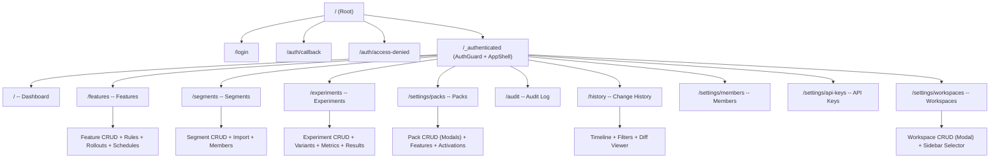

# UI Flow Diagram -- Feature Evaluator Console

Overview of all screens, navigation, and interactions. Each module has a dedicated flow document with detailed interaction maps.

---

## Site Map

---

## Module Flows

| Module                                       | Document                                                                            | Screens    |
| -------------------------------------------- | ----------------------------------------------------------------------------------- | ---------- |
| [Auth](flows/auth-flow.md)                   | Login, callback, access denied                                                      | 3          |
| [Dashboard](flows/dashboard-flow.md)         | Stats, activity, error summary, metrics charts                                      | 1          |
| [Features](flows/features-flow.md)           | List, create, detail, edit, rules CRUD, expression editor                           | 6          |
| [Segments](flows/segments-flow.md)           | List, detail, import wizard, member table (create/edit via modal)                   | 3 + modals |
| [Packs](flows/packs-flow.md)                 | List, detail (features + activations) (create/edit via modal)                       | 2 + modals |
| [Members](flows/members-flow.md)             | Member table, add dialog, role management                                           | 1          |
| [API Keys](flows/api-keys-flow.md)           | API key table, create dialog, created key dialog                                    | 1          |
| [Audit](flows/audit-flow.md)                 | Error log, filters, pagination                                                      | 1          |
| [Rollouts](flows/rollout-flow.md)            | Percentage rollout in rule form + badge in rule list                                | 0 (inline) |
| [Change History](flows/history-flow.md)      | Timeline, filters, diff viewer, feature detail integration                          | 1 + dialog |
| [Workspaces](flows/workspaces-flow.md)       | Workspace list, create dialog, archive/restore actions, sidebar selector, API header | 1 + dialog |
| [Schedules](flows/schedules-flow.md)         | Schedule dialog, pending schedules section (on feature detail)                      | 0 (inline) |
| [Experiments](flows/experiments-flow.md)      | List, create, detail (edit or dashboard), variants, metrics, results, winner        | 3          |

---

## App Shell Layout

All authenticated routes render inside `AppShell`:

| Zone   | Component    | Contents                                                                                         |
| ------ | ------------ | ------------------------------------------------------------------------------------------------ |
| Left   | `AppSidebar` | Workspace selector, navigation links, collapse toggle (desktop), overlay drawer (mobile)         |
| Top    | `AppHeader`  | Hamburger (mobile), `LanguageToggle`, `ThemeToggle`, `UserMenu`                                  |
| Center | `<main>`     | Route outlet                                                                                     |

### Sidebar Navigation

| Label        | Route                   | Icon            | Flow                                        |
| ------------ | ----------------------- | --------------- | ------------------------------------------- |
| *(Workspace selector)* |                | ChevronsUpDown  | [Workspaces](flows/workspaces-flow.md)      |
| Dashboard    | `/`                     | LayoutDashboard | [Dashboard](flows/dashboard-flow.md)        |
| Features     | `/features`             | ToggleLeft      | [Features](flows/features-flow.md)          |
| Segments     | `/segments`             | Users           | [Segments](flows/segments-flow.md)          |
| Experiments  | `/experiments`          | FlaskConical    | [Experiments](flows/experiments-flow.md)    |
| Audit        | `/audit`                | FileWarning     | [Audit](flows/audit-flow.md)               |
| History      | `/history`              | History         | [Change History](flows/history-flow.md)     |
| **Settings** |                         |                 |                                             |
| Members      | `/settings/members`     | Settings        | [Members](flows/members-flow.md)            |
| API Keys     | `/settings/api-keys`    | Key             | [API Keys](flows/api-keys-flow.md)          |
| Packs        | `/settings/packs`       | Package         | [Packs](flows/packs-flow.md)               |
| Workspaces   | `/settings/workspaces`  | Building2       | [Workspaces](flows/workspaces-flow.md)      |

### Header Actions

| Element            | Action                                       |
| ------------------ | -------------------------------------------- |
| Hamburger (mobile) | Opens sidebar drawer                         |
| Language icon      | Switch `es` / `en`                           |
| Theme icon         | `light` / `dark` / `system`                  |
| Avatar             | UserMenu dropdown: name, email, role, logout |

---

## Shared Components

### PageHeader

Reusable page header component (`components/shared/page-header.tsx`).

| Prop          | Type          | Description                               |
| ------------- | ------------- | ----------------------------------------- |
| `title`       | `string`      | Page title (h1, bold, 2xl)                |
| `description` | `string?`     | Subtitle (muted text)                     |
| `actions`     | `ReactNode?`  | Right-aligned action buttons              |
| `onBack`      | `() => void?` | Shows ArrowLeft ghost button before title |

Used on: feature create/edit, rule create/edit, all list pages, dashboard, API keys, segments, packs, history, experiments, workspaces.

---

## Unsaved Changes Protection

Feature and rule forms use `useUnsavedChanges` hook (`hooks/use-unsaved-changes.tsx`):

- Tracks `isDirty` state (form fields + external state like tags, environments, expression, scope, rollout percentage)
- Registers browser `beforeunload` event to warn on tab close/refresh
- Back button / Cancel button triggers `handleBack` which shows AlertDialog if dirty
- AlertDialog: "Stay" (cancel) or "Leave" (discard changes and navigate)

Forms using this pattern: `FeatureForm` (create/edit), `RuleForm` (create/edit).

---

## Permission-Gated Elements

| Permission          | Gated Elements                                                            | Module                                                               |
| ------------------- | ------------------------------------------------------------------------- | -------------------------------------------------------------------- |
| `features.write`    | Create/edit/delete feature, toggle, create/edit/delete/reorder rules      | [Features](flows/features-flow.md)                                   |
| `features.write`    | Create/edit/delete pack, toggle, add/remove features, activate/deactivate | [Packs](flows/packs-flow.md)                                        |
| `features.write`    | Schedule changes on features                                              | [Schedules](flows/schedules-flow.md)                                 |
| `segments.write`    | Create/edit/delete segment, import members, bulk delete members           | [Segments](flows/segments-flow.md)                                   |
| `members.manage`    | Add member, change role, remove member, create/delete API keys            | [Members](flows/members-flow.md), [API Keys](flows/api-keys-flow.md) |
| `experiments.write` | Create/edit experiments, start/pause/complete, declare winner             | [Experiments](flows/experiments-flow.md)                             |
| `settings.manage`   | Create workspaces                                                         | [Workspaces](flows/workspaces-flow.md)                               |
| `workspace.delete`  | Archive and restore workspaces                                            | [Workspaces](flows/workspaces-flow.md)                               |

---

## Responsive Breakpoints

| Breakpoint          | Sidebar                 | Tables       | Expression Editor  |
| ------------------- | ----------------------- | ------------ | ------------------ |
| Mobile `< 1024px`   | Drawer overlay          | Card layout  | Visual mode only   |
| Desktop `>= 1024px` | Persistent, collapsible | Table layout | Visual + text mode |

---

## Global Dialogs

| Dialog               | Trigger                        | Location                    |
| -------------------- | ------------------------------ | --------------------------- |
| UserMenu             | Avatar click                   | Header (all pages)          |
| ThemeToggle          | Theme icon                     | Header (all pages)          |
| LanguageToggle       | Language icon                  | Header (all pages)          |
| UnsavedChangesDialog | Back/Cancel on dirty form      | Feature + Rule create/edit  |
| ActivateDialog       | "Activate" on pack detail      | Pack detail activations tab |
| ScheduleDialog       | "Schedule Change" on feature   | Feature detail header       |
| ChangeDiffDialog     | Click event card with changes  | History page / feature detail |
| WorkspaceFormDialog  | "+ Create" on workspaces page  | Workspace settings page     |

---

## i18n Namespaces

| Namespace     | Used By                        |
| ------------- | ------------------------------ |
| `common`      | Shared labels (pagination, actions) |
| `auth`        | Login, callback, access denied |
| `dashboard`   | Dashboard page                 |
| `features`    | Feature list, create, edit, detail |
| `rules`       | Rule form, list, rollout section |
| `segments`    | Segment list, detail, import   |
| `packs`       | Pack list, detail, dialogs     |
| `settings`    | Members, API keys              |
| `audit`       | Audit error log                |
| `history`     | Change history timeline, filters, diff |
| `workspaces`  | Workspace selector, settings, form |
| `schedules`   | Schedule dialog, pending schedules |
| `experiments` | Experiment list, form, dashboard, results |

Files located at: `console/public/assets/locales/{es,en}/{namespace}.json`
