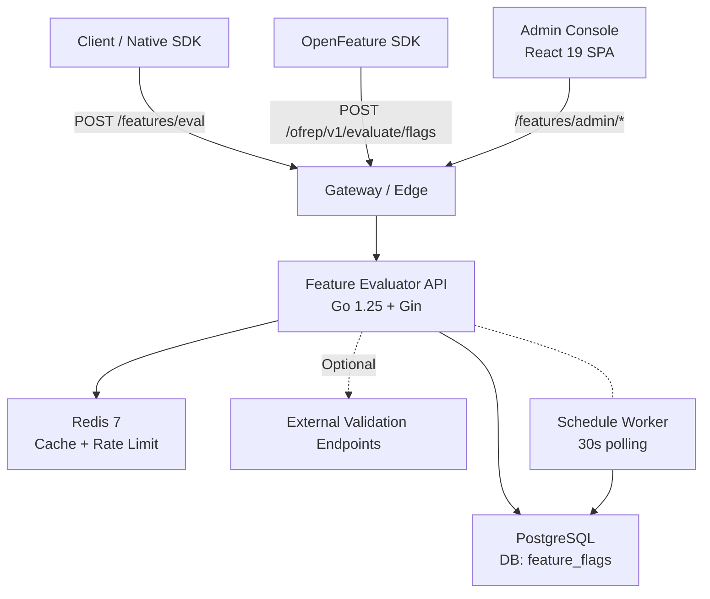
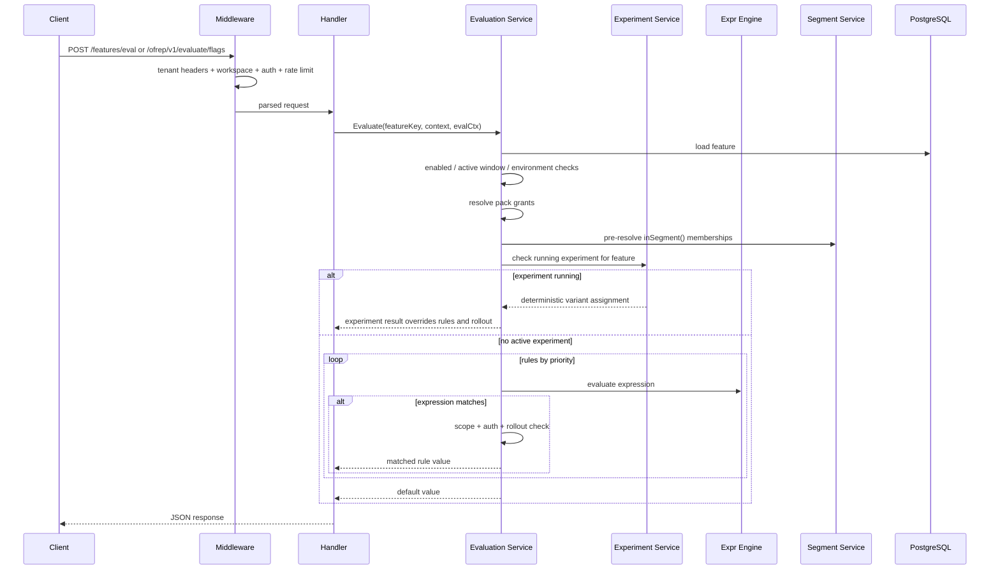

# Architecture

System design and runtime flow for the Feature Evaluator.

## Overview

The system has two deployable units:

- `server/`: Go 1.25 API built with Gin, PostgreSQL, Redis, and `expr-lang`
- `console/`: React 19 SPA built with Vite, TanStack Router, and TanStack Query

The backend exposes two public API surfaces:

- `/features`: native evaluation and admin API
- `/ofrep/v1`: OpenFeature Remote Evaluation Protocol endpoints

Workspace isolation is applied at request time through the `X-Workspace` header. If the header is absent, the server falls back to the `default` workspace for backward compatibility.

## System Diagram



## Backend Structure

Dependency direction stays strict:

```text
handlers -> domain services -> repository interfaces <- storage implementations
```

### Layers

| Layer | Location | Responsibility |
| --- | --- | --- |
| Entry | `cmd/server/main.go` | config loading, DI wiring, graceful shutdown |
| Config | `internal/config/` | env var parsing and defaults via Viper |
| Server | `internal/server/` | route registration and middleware composition |
| Middleware | `internal/server/middleware/` | auth, rate limit, workspace resolution, request pipeline |
| Domain | `internal/domain/` | business rules with zero external dependencies |
| Engine | `internal/engine/` | `expr-lang` compile/cache/evaluate |
| External | `internal/external/` | outbound HTTP validation with circuit breaker |
| Handler | `internal/handler/` | HTTP DTO translation only |
| DTO | `internal/dto/` | request/response types and mappers |
| Storage | `internal/storage/` | PostgreSQL and Redis adapters |
| Errors | `pkg/apierror/` | structured API error responses |

### Domain Packages

| Package | Purpose |
| --- | --- |
| `feature` | features, rules, rollout salt, CRUD |
| `evaluation` | eval orchestration, reasons, bulk/all evaluation |
| `segment` | segment CRUD and membership resolution |
| `pack` | feature bundles and activations |
| `member` | RBAC, roles, permissions, ownership |
| `apikey` | eval and admin API keys |
| `tag` | feature tags |
| `audit` | evaluation error logging |
| `changelog` | immutable admin change history |
| `workspace` | workspace CRUD and request scoping |
| `schedule` | scheduled feature changes and worker |
| `experiment` | experiments, exposures, conversions, stats |
| `metrics` | runtime metrics collection |

## Request Pipeline

### Global Middleware

Applied to all requests in this order:

| Order | Middleware | Responsibility |
| --- | --- | --- |
| 1 | `Recovery()` | panic recovery and structured error logging |
| 2 | `RequestID()` | request correlation ID |
| 3 | `BodySizeLimit(1<<20)` | 1 MB request cap |
| 4 | `Logging()` | request/response logs via `slog` |
| 5 | `CORS()` | origin validation and allowed headers |
| 6 | `TenantExtractor()` | `X-Tenant-ID`, `X-Campus-ID`, `X-Program-ID` |
| 7 | `WorkspaceResolver()` | `X-Workspace` -> request context, fallback `default` |

### Route-Level Middleware

| Middleware | Routes | Responsibility |
| --- | --- | --- |
| `RequireActiveWorkspace()` | eval, OFREP, admin | rejects unknown or archived workspaces |
| `EvalAuth()` | `/features/eval*`, `/ofrep/v1/*` | Bearer JWT or API key |
| `AdminAuth()` | `/features/admin/*` | Bearer JWT or admin API key |
| `WorkspaceReadAuth()` | workspace read routes | reads workspaces without requiring current workspace membership |
| `WorkspaceManageAuth()` | workspace mutation routes | bootstrap-safe auth for workspace lifecycle |
| `RequirePermission()` | admin sub-groups | per-role or per-API-key authorization |
| `RateLimiter` | eval, OFREP, admin | Redis-backed fail-open rate limiting |

## Evaluation Flow

The native evaluation endpoints and OFREP endpoints both call the same `evaluation.Service`.



### Native Evaluation Order

1. Load feature for the current workspace.
2. Reject disabled, not-yet-active, expired, or environment-mismatched features.
3. Resolve pack activations; a granted pack can bypass rule scope restrictions.
4. Pre-scan `inSegment()` calls and batch-resolve memberships.
5. If a running experiment exists for the feature, assign a variant deterministically and return it.
6. Otherwise evaluate rules by priority.
7. For a matching rule, apply rollout percentage if configured.
8. If a rule requires external validation, execute the outbound call.
9. Fall back to `defaultValue` if no rule applies.

### Native Evaluation Reasons

Internal responses use these reason values:

| Reason | Meaning |
| --- | --- |
| `matched_rule` | a rule matched and returned its value |
| `default_value` | no rule matched |
| `experiment` | running experiment overrode rule evaluation |
| `feature_disabled` | feature disabled |
| `not_yet_active` | before `activeFrom` |
| `expired` | after `activeUntil` |
| `environment_mismatch` | current environment not enabled |
| `rollout_excluded` | rule matched but rollout excluded the user |
| `error` | evaluation failed and was logged |

## OFREP Adapter

`internal/handler/ofrep.go` provides an OFREP-compatible facade over the same evaluation service.

### Context Mapping

- `context.targetingKey` -> `context.user.id`
- `tenantId` -> `tenant.id`
- `campusId` -> `campus.id`
- `programId` -> `program.id`
- other flat keys -> `user.*`
- already namespaced nested contexts are accepted as-is

### OFREP Reason Mapping

| Internal reason | OFREP reason |
| --- | --- |
| `matched_rule` | `TARGETING_MATCH` |
| `default_value` | `STATIC` |
| `experiment` | `SPLIT` |
| `feature_disabled`, `not_yet_active`, `expired`, `environment_mismatch` | `DISABLED` |
| everything else | `UNKNOWN` |

Bulk OFREP responses emit an `ETag`. Requests with a matching `If-None-Match` return `304 Not Modified`.

## Workspace Isolation

Every workspace-scoped entity stores `workspaceKey`, including:

- features
- segments and segment members
- packs and activations
- tags
- API keys
- changelog entries
- schedules
- experiments, exposures, and conversions

The startup migration ensures a `default` workspace exists and backfills legacy documents into that workspace. Unique indexes were widened so keys can repeat across workspaces.

## Scheduled Changes

The schedule subsystem consists of:

- `schedule.Service`: validation and CRUD
- `schedule.Worker`: background executor
- PostgreSQL atomic claim via `FOR UPDATE SKIP LOCKED`

Runtime behavior:

- worker interval: 30 seconds
- execution context: scoped to `ScheduledChange.WorkspaceKey`
- multi-instance safety: row claim with `FOR UPDATE SKIP LOCKED`
- executed changes write changelog entries with `Actor: "system:scheduler"` and `ActorType: "system"`

## Caching and Resilience

| Resource | Backend | Notes |
| --- | --- | --- |
| segment membership | Redis | 5 min TTL, invalidated on imports/deletes |
| pack activations | Redis | 5 min TTL |
| running experiment | Redis | 60 s TTL |
| compiled expressions | in-memory | LRU cache of compiled programs |
| JWKS | in-memory | cached and refreshed by validator |
| external validation | Redis + circuit breaker | fail-open/fail-closed per rule behavior |

Failure modes:

- Redis is fail-open for caching and rate limiting.
- evaluation errors are persisted to `eval_errors`.
- changelog writes are fire-and-forget so admin mutations are not blocked by history persistence.

## Frontend Structure

### Provider Stack

```text
QueryClientProvider
  -> AuthProvider
    -> GlobalLoadingProvider
      -> RouterProvider
```

### Frontend Patterns

| Concern | Solution |
| --- | --- |
| server state | TanStack Query |
| routing | TanStack Router file-based routes |
| auth | OIDC via `oidc-client-ts` |
| forms | React Hook Form + Zod |
| workspace selection | Zustand store + `X-Workspace` request header |
| i18n | `react-i18next`, Spanish default |

Console modules cover the implemented admin surface: features, rules, segments, packs, history, schedules, experiments, members, API keys, audit, and workspaces.

## Storage Model

The PostgreSQL schema is workspace-aware. Core tables include:

- `features`
- `segments`
- `segment_records`
- `members`
- `tags`
- `feature_rules`
- `feature_tags`
- `api_keys`
- `packs`
- `pack_features`
- `pack_activations`
- `eval_errors`
- `changelog`
- `workspaces`
- `schedules`
- `experiments`
- `experiment_exposures`
- `experiment_conversions`

## Operational Notes

- startup runs PostgreSQL migrations automatically
- the HTTP server sets `ReadHeaderTimeout` to 5 seconds
- graceful shutdown stops the metrics collector and schedule worker before closing infra clients
