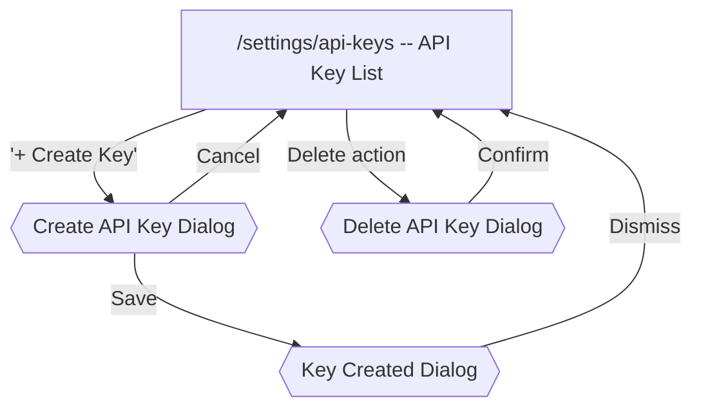

# API Keys Flow

[< Back to Overview](../UI-FLOW.md)

---

## Flow Diagram

---

## Screen: `/settings/api-keys` -- API Keys

| Element               | Type    | Action                                                |
| --------------------- | ------- | ----------------------------------------------------- |
| PageHeader            | Display | Title + subtitle via `PageHeader`                     |
| "+ Create Key" button | Button  | Opens Create API Key dialog (perm: `members.manage`)  |
| API key table         | Table   | Columns: name, type, description, expiration, actions |
| Delete action         | Button  | Opens delete ConfirmDialog (perm: `members.manage`)   |
| Empty state           | Display | Title + description when no keys exist                |

---

## Dialogs

### Create API Key Dialog

Modal dialog (`Dialog` component, `sm:max-w-md`).

| Element         | Type        | Action                                                                       |
| --------------- | ----------- | ---------------------------------------------------------------------------- |
| Name input      | Field       | Required                                                                     |
| Description     | Textarea    | Optional                                                                     |
| Type            | Radio group | `eval` (evaluation only) / `admin` (admin access)                            |
| Permissions     | Checkboxes  | Shown only when type = `admin`. Multi-select from `AllowedAPIKeyPermissions` |
| Expiration date | Date input  | Optional expiration date                                                     |
| "Cancel"        | Button      | Closes dialog                                                                |
| "Create"        | Submit      | POST → closes dialog → opens Key Created dialog                              |

### Key Created Dialog

Non-dismissable modal dialog (no close on click-outside, no escape key). Shows the raw API key **once**.

| Element         | Type    | Action                                               |
| --------------- | ------- | ---------------------------------------------------- |
| Warning banner  | Display | AlertTriangle icon + "This key won't be shown again" |
| Raw key display | Code    | Monospace, break-all, with copy button               |
| Copy button     | Button  | Copies key to clipboard (Check icon for 2s feedback) |
| Dismiss button  | Button  | Closes dialog, key is no longer retrievable          |

### Delete API Key Dialog

| Element       | Type                   | Action                   |
| ------------- | ---------------------- | ------------------------ |
| ConfirmDialog | Standard (destructive) | Confirm → DELETE API key |
| "Cancel"      | Action                 | Close dialog             |
| "Confirm"     | Submit                 | DELETE → refresh list    |

---

## Permission Gates

| Permission       | Gated Elements             |
| ---------------- | -------------------------- |
| `members.manage` | Create and delete API keys |
