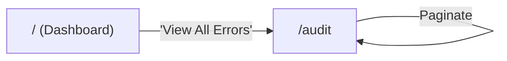

# Audit Flow

[< Back to Overview](../UI-FLOW.md)

---

## Flow Diagram

---

## Screen: `/audit` -- Audit Log

| Element           | Type    | Action                                                                         |
| ----------------- | ------- | ------------------------------------------------------------------------------ |
| Feature key input | Filter  | Filter by feature key                                                          |
| Tenant ID input   | Filter  | Filter by tenant ID                                                            |
| Error type input  | Filter  | Filter by error type                                                           |
| From date picker  | Filter  | Start date                                                                     |
| To date picker    | Filter  | End date                                                                       |
| Audit table rows  | Display | Columns: date, feature key, error type (badge), message, tenant ID, request ID |
| Pagination        | State   | Previous / Next                                                                |
| Empty state       | Display |                                                                                |

> **Mobile**: renders `AuditMobileCard` list.

---

## Data Source

- Backend: `eval_errors` table
- TTL: 30 days auto-expiry
- Sanitized: no stack traces, no expression text, no user context
