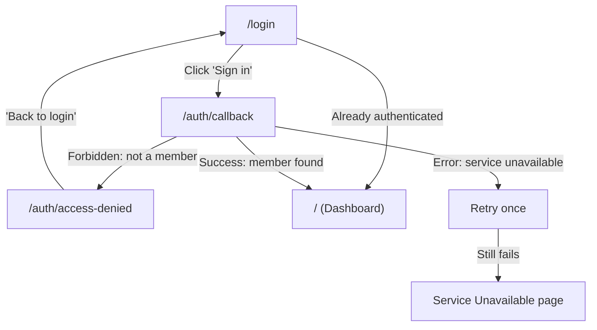

# Auth Flow

[< Back to Overview](../UI-FLOW.md)

---

## Flow Diagram

---

## Screens

### `/login` -- Login Page

| Element          | Type     | Action                                      |
| ---------------- | -------- | ------------------------------------------- |
| "Sign in" button | Button   | Calls `login()` → OIDC redirect (PKCE S256) |
| _(auto)_         | Redirect | If already authenticated → `/`              |

> **Dev mode**: Auth disabled, mock user injected via env vars. Login page auto-redirects.

---

### `/auth/callback` -- Auth Callback

| Element  | Type     | Action                                              |
| -------- | -------- | --------------------------------------------------- |
| _(auto)_ | Handler  | Exchanges OAuth code → tokens (sessionStorage)      |
| _(auto)_ | API call | GET `/admin/members/me` → member found → dashboard  |
| _(auto)_ | Redirect | Not found → `/auth/access-denied`                   |
| _(auto)_ | Retry    | Error → retry once → "service unavailable" fallback |

---

### `/auth/access-denied` -- Access Denied

| Element                | Type | Action                |
| ---------------------- | ---- | --------------------- |
| "Back to login" button | Link | Navigates to `/login` |

---

## Token Lifecycle

- `automaticSilentRenew` for refresh
- Token expired → modal "session expired" → re-auth → return to same URL
- Backend: JWT validated via JWKS (cached 1hr in-memory)
