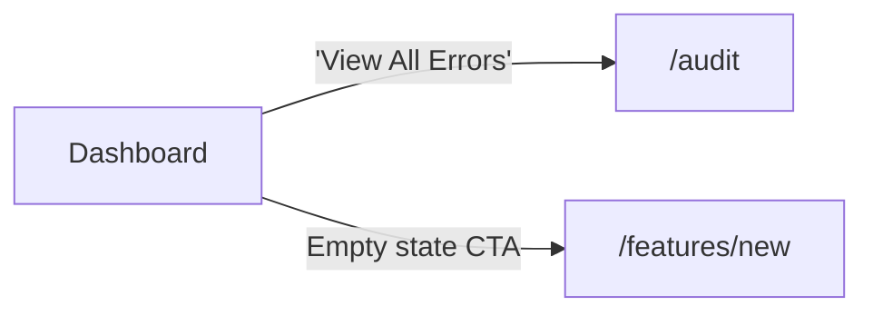

# Dashboard Flow

[< Back to Overview](../UI-FLOW.md)

---

## Screen: `/` -- Dashboard

---

## Interaction Map

| Element                  | Type    | Action                                                                                        |
| ------------------------ | ------- | --------------------------------------------------------------------------------------------- |
| PageHeader               | Display | Title + description via `PageHeader` component                                                |
| Stats grid (4 cards)     | Display | Total features, active features, total segments, total segment members                        |
| Activity feed            | Display | Recent actions: feature_created, feature_updated, feature_toggled, rule_created, rule_updated |
| Error summary card       | Display | Error count by type + badge                                                                   |
| "View All Errors" button | Link    | Navigates to `/audit`                                                                         |
| Metrics section          | Display | Collapsible panel with charts (see below)                                                     |
| Empty state CTA          | Link    | Navigates to `/features/new` (perm: `features.write`)                                         |

### Metrics Section (collapsible)

The metrics section is a bordered collapsible panel (`Radix Collapsible`) with:

| Element            | Type    | Action                                               |
| ------------------ | ------- | ---------------------------------------------------- |
| Section header     | Button  | Toggle collapse. Icon: BarChart3 + ChevronDown       |
| Refresh button     | Button  | Invalidates all dashboard queries (animated spinner) |
| Metrics overview   | Display | Summary metrics cards                                |
| Top features chart | Display | Bar chart of most evaluated features                 |
| Reason breakdown   | Display | Pie/bar chart of evaluation reasons                  |
| Environment chart  | Display | Chart of evaluations by environment                  |

All chart components use `Suspense` with skeleton fallbacks.

---

## Layout

| Viewport | Layout                                                                                       |
| -------- | -------------------------------------------------------------------------------------------- |
| Mobile   | Stats cards stacked 1-column, activity feed below                                            |
| Desktop  | Stats cards 2x2 grid, activity (2/3) + errors (1/3) side by side, metrics section full width |
