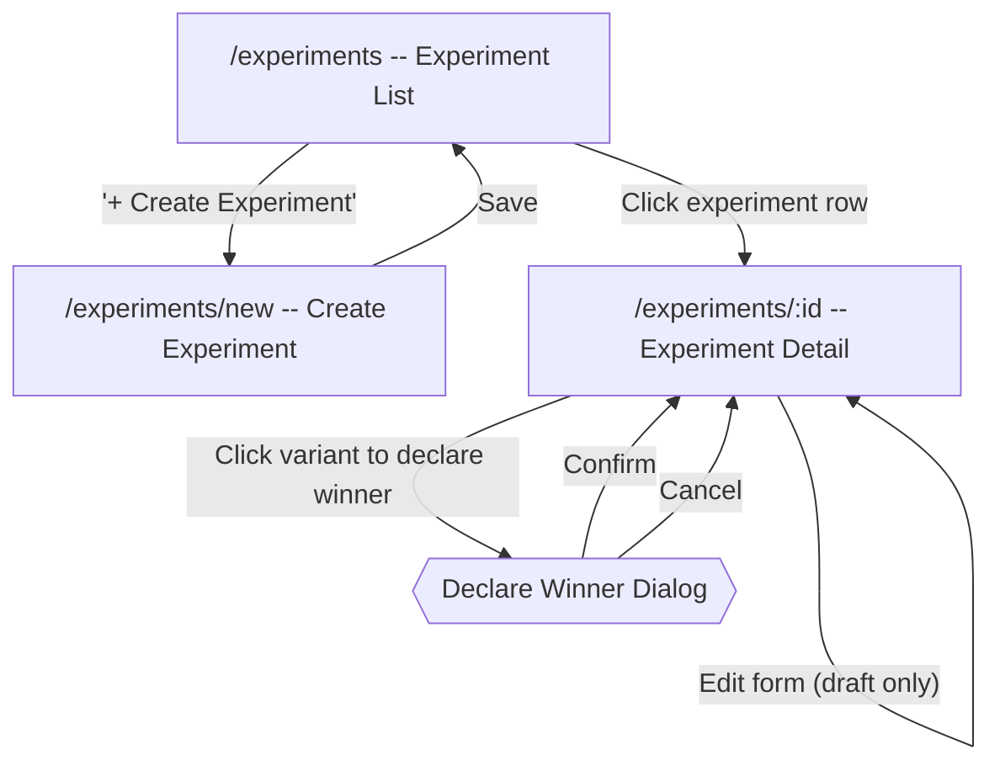

# A/B Testing / Experiments Flow

[< Back to Overview](../UI-FLOW.md)

---

## Flow Diagram

---

## Screens

### `/experiments` -- Experiment List

**Route**: `console/src/routes/_authenticated/experiments/index.tsx`

| Element | Type | Action |
|---|---|---|
| Page header | `PageHeader` | Title + description + "+ Create Experiment" action |
| "+ Create Experiment" button | `PermissionButton` (link) | Permission: `experiments.write`. Navigates to `/experiments/new` |
| Experiment list | `ExperimentList` | Clickable rows linking to detail pages |
| Empty state | `EmptyState` | FlaskConical icon + message + create CTA |

---

### Experiment List Component

**Component**: `console/src/components/experiments/experiment-list.tsx`

Each experiment renders as a card-style link:

| Element | Type | Details |
|---|---|---|
| Name | Text | `font-medium` |
| Status badge | `ExperimentStatusBadge` | Color-coded by status |
| Winner badge | `Badge variant="success"` | Shown only when `winnerKey` is set. Shows "Winner: [key]" |
| Feature key | Text | "Feature key: [key]" with monospace key |
| Variant count | Text | "N variants" |
| Created date | Text | Right-aligned, muted, xs size |

**Status badge colors** (`ExperimentStatusBadge`):

| Status | Badge Variant |
|---|---|
| `draft` | `secondary` (gray) |
| `running` | `success` (green) |
| `paused` | `warning` (yellow) |
| `completed` | `default` |

---

### `/experiments/new` -- Create Experiment

**Route**: `console/src/routes/_authenticated/experiments/new.tsx`

Full-page route with `PageHeader` (title + description). Pre-loads all feature keys (up to 1000) for the feature key selector.

Contains the `ExperimentForm` component (see below).

---

### `/experiments/:id` -- Experiment Detail

**Route**: `console/src/routes/_authenticated/experiments/$experimentId.tsx`

Displays either an edit form (draft) or results dashboard (running/paused/completed).

| Element | Type | Condition |
|---|---|---|
| `ExperimentDetailHeader` | Header | Always shown |
| `ExperimentForm` | Form | When `status === 'draft'` |
| `ExperimentDashboard` | Dashboard | When `status !== 'draft'` |

---

## Components

### Experiment Detail Header

**Component**: `console/src/components/experiments/experiment-detail-header.tsx`

| Element | Type | Details |
|---|---|---|
| Experiment name | h1, bold, 2xl | -- |
| Status badge | `ExperimentStatusBadge` | Current lifecycle status |
| Description | Text | Muted, shown if present |
| Feature key | Text | "Feature key: [key]" monospace |
| Lifecycle action buttons | `PermissionButton` | Permission: `experiments.write`. Shown based on current status (see below) |

**Lifecycle Actions**:

| Current Status | Available Actions |
|---|---|
| `draft` | "Start" button (primary) |
| `paused` | "Start" button (primary) |
| `running` | "Pause" button (outline) + "Complete" button (destructive) |
| `completed` | No action buttons |

Each action triggers a mutation (start, pause, complete) with toast feedback.

---

### Experiment Form

**Component**: `console/src/components/experiments/experiment-form.tsx`

Used for both create and edit (draft only).

| Section | Element | Type | Details |
|---|---|---|---|
| Feature Key | Select dropdown | Native `<select>` | Required on create. Hidden on edit. Lists all feature keys from the system |
| Name | Input | Required | Experiment name |
| Description | Input | Optional | Experiment description |
| Variants | `VariantEditor` | Component | See below |
| Metrics | `MetricEditor` | Component | See below |
| Actions | Submit + Cancel | Buttons | Save/Create + Cancel (navigates to `/experiments`) |

**State management**: Uses local `useState` for all fields (not react-hook-form). Defaults for new experiments: two variants (`control` at 50%, `treatment` at 50%), empty metrics array.

---

### Variant Editor

**Component**: `console/src/components/experiments/variant-editor.tsx`

Dynamic list of variant rows with add/remove capability.

| Element | Type | Details |
|---|---|---|
| "Variants" label | Label | Section heading |
| "+ Add Variant" button | Button (outline, sm) | Adds a new row with default weight 50 |
| Variant row: Key | Input | Monospace. Placeholder: "control" |
| Variant row: Value | Input | The value returned when this variant is assigned |
| Variant row: Weight | Number input | 0-100, controls traffic allocation percentage |
| Variant row: Delete | Button (ghost, destructive) | Trash icon. Disabled when only 2 variants remain (minimum 2) |

All fields are disabled when `disabled` prop is true (non-draft experiments).

---

### Metric Editor

**Component**: `console/src/components/experiments/metric-editor.tsx`

Dynamic list of metric rows with add/remove capability.

| Element | Type | Details |
|---|---|---|
| "Metrics" label | Label | Section heading |
| "+ Add Metric" button | Button (outline, sm) | Adds a new row with empty fields |
| "No metrics" text | Text | Shown when metrics array is empty |
| Metric row: Key | Input | Monospace. Placeholder: "signup" |
| Metric row: Name | Input | Display name for the metric |
| Metric row: Delete | Button (ghost, destructive) | Trash icon |

All fields are disabled when `disabled` prop is true (non-draft experiments).

---

### Experiment Dashboard

**Component**: `console/src/components/experiments/experiment-dashboard.tsx`

Shown when the experiment is running, paused, or completed.

| Element | Type | Details |
|---|---|---|
| Results chart | `ExperimentResultsChart` | Bar chart of conversion rates per variant |
| Results table | `ExperimentResultsTable` | Detailed stats per variant |
| Declare winner section | Buttons | Variant buttons to declare a winner (see below) |
| Winner display | Badge | Shown when `winnerKey` is set |
| Declare winner dialog | `ConfirmDialog` | Confirmation before declaring winner |

**Declare Winner**:
- Shown only when: no winner yet AND status is `running` or `completed`
- Each variant has a `PermissionButton` (permission: `experiments.write`)
- Clicking a variant opens a `ConfirmDialog`
- Confirming triggers `declareWinner` mutation with the variant key

---

### Experiment Results Chart

**Component**: `console/src/components/experiments/experiment-results-chart.tsx`

Uses Recharts (`BarChart` with `ResponsiveContainer`):
- X-axis: variant keys
- Y-axis: conversion rate (percentage)
- Bars use `hsl(var(--chart-1))` theme color
- Height: `h-64`

---

### Experiment Results Table

**Component**: `console/src/components/experiments/experiment-results-table.tsx`

| Column | Details |
|---|---|
| Variant | Variant key (monospace) + winner badge if applicable |
| Exposures | Number of users exposed |
| Conversions | Number of conversions |
| Conversion Rate | Percentage formatted to 2 decimal places |
| Confidence | Confidence interval range (low% - high%) |

Summary stats above the table:
- Total exposures (bold)
- Total conversions (bold)
- "Statistically Significant" badge (`Badge variant="success"`) when `isSignificant` is true

---

## Sidebar Navigation

| Label | Route | Icon | Position |
|---|---|---|---|
| Experimentos / Experiments | `/experiments` | FlaskConical (lucide) | Main nav, after Segments |

---

## API

Experiment types from `console/src/api/types.ts`:

- `ExperimentStatus`: `draft` | `running` | `paused` | `completed`
- `Variant`: `{ key: string; value: unknown; weight: number }`
- `ExperimentMetric`: `{ key: string; name: string; description?: string }`
- `Experiment`: `id`, `workspaceKey`, `featureKey`, `name`, `description`, `status`, `variants`, `metrics`, `winnerKey?`, `startedAt?`, `completedAt?`, `createdBy`, `createdAt`, `updatedAt`
- `VariantStats`: `variantKey`, `exposures`, `conversions`, `conversionRate`, `confidenceLow`, `confidenceHigh`
- `ExperimentResults`: `experimentId`, `totalExposures`, `totalConversions`, `variants` (array of `VariantStats`), `isSignificant`

---

## i18n

**Namespace**: `experiments`
**Files**: `console/public/assets/locales/{es,en}/experiments.json`

Key groups:
- `title`, `description` -- page header
- `create` -- create button label
- `featureKey`, `variantsCount`, `winner` -- list display
- `empty.title`, `empty.description` -- empty state
- `status.*` -- draft, running, paused, completed labels
- `form.*` -- form fields (createTitle, createDescription, editTitle, name, description, featureKey, selectFeature, variants, addVariant, variantKey, variantValue, weight, metrics, addMetric, metricKey, metricName, noMetrics, save, create, success, error)
- `actions.*` -- lifecycle actions (start, pause, complete, started, paused, completed, startError, pauseError, completeError, declareWinner, declareWinnerConfirm, winnerDeclared, winnerError)
- `results.*` -- dashboard (title, totalExposures, totalConversions, significant, variant, exposures, conversions, conversionRate, confidence)

---

## Permission Gates

| Permission | Gated Elements |
|---|---|
| `experiments.write` | Create experiment, start/pause/complete lifecycle actions, declare winner |

---

## User Flow

### Creating an Experiment

1. Admin navigates to `/experiments` via sidebar
2. Clicks "+ Create Experiment"
3. On `/experiments/new`: selects a feature key, enters name/description
4. Configures variants (min 2): sets key, value, and weight for each
5. Optionally adds metrics with key and name
6. Clicks "Create" -- experiment is created in `draft` status, navigates to `/experiments`

### Running an Experiment

1. Admin clicks an experiment row to go to `/experiments/:id`
2. While in `draft` status, the edit form is shown -- admin can modify variants/metrics
3. Clicks "Start" -- experiment moves to `running` status
4. Dashboard replaces edit form, showing results chart and table
5. Optionally clicks "Pause" to temporarily halt the experiment
6. Clicks "Complete" to end data collection

### Declaring a Winner

1. On a running or completed experiment detail page
2. The "Declare Winner" section shows one button per variant
3. Admin clicks the desired variant button
4. Confirm dialog appears
5. On confirmation, the winner is recorded and displayed with a success badge

---

## Component Files

| File | Purpose |
|---|---|
| `console/src/routes/_authenticated/experiments/index.tsx` | Experiment list page |
| `console/src/routes/_authenticated/experiments/new.tsx` | Create experiment page |
| `console/src/routes/_authenticated/experiments/$experimentId.tsx` | Experiment detail page (edit or dashboard) |
| `console/src/components/experiments/experiment-list.tsx` | Experiment card list |
| `console/src/components/experiments/experiment-form.tsx` | Create/edit form with feature key selector |
| `console/src/components/experiments/experiment-dashboard.tsx` | Results dashboard with chart, table, winner declaration |
| `console/src/components/experiments/experiment-detail-header.tsx` | Header with lifecycle action buttons |
| `console/src/components/experiments/variant-editor.tsx` | Dynamic variant row editor |
| `console/src/components/experiments/metric-editor.tsx` | Dynamic metric row editor |
| `console/src/components/experiments/experiment-results-table.tsx` | Results table with per-variant stats |
| `console/src/components/experiments/experiment-results-chart.tsx` | Recharts bar chart for conversion rates |
| `console/src/components/experiments/experiment-status-badge.tsx` | Status badge component |
| `console/src/queries/experiment-queries.ts` | TanStack Query factories |
| `console/src/mutations/experiment-mutations.ts` | TanStack Query mutations |
