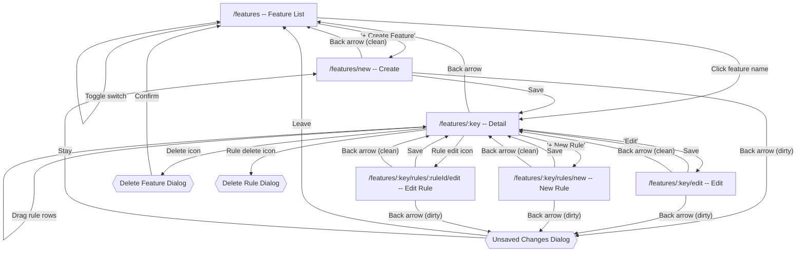

# Features Flow

[< Back to Overview](../UI-FLOW.md)

---

## Flow Diagram

---

## Screens

### `/features` -- Feature List

| Element                         | Type   | Action                                     |
| ------------------------------- | ------ | ------------------------------------------ |
| "+ Create Feature" button       | Link   | → `/features/new` (perm: `features.write`) |
| Search input                    | Filter | Debounced text search, resets page         |
| "All / Enabled / Disabled" tabs | Filter | Filter by enabled state                    |
| Feature name (row/card)         | Link   | → `/features/:key`                         |
| Toggle switch (per row)         | API    | PATCH toggle + optimistic UI               |
| Pagination                      | State  | Previous / Next                            |
| Empty state CTA                 | Link   | → `/features/new`                          |

> **Mobile**: renders `FeatureCard` list instead of table.

---

### `/features/new` -- Create Feature

Full-page route with `PageHeader` (title + back arrow). Uses `FeatureForm` component with unsaved changes detection.

The form is organized into **4 card sections** (`FormSection` component: bordered card with header + body):

#### Section 1: General

| Element     | Type  | Action                               |
| ----------- | ----- | ------------------------------------ |
| Key input   | Field | Monospace, regex-validated, required |
| Name input  | Field | Required                             |
| Description | Field | Optional                             |

#### Section 2: Value

| Element           | Type          | Action                                                |
| ----------------- | ------------- | ----------------------------------------------------- |
| Value Type select | Select        | `boolean` / `string` / `number` / `json`              |
| Default Value     | Dynamic field | Select (bool), Input (string/number), Textarea (json) |

#### Section 3: Tags

| Element      | Type      | Action                                                     |
| ------------ | --------- | ---------------------------------------------------------- |
| Tag combobox | Component | `TagCombobox`: search/select color tags for categorization |

#### Section 4: Scheduling & Environments

| Element               | Type           | Action                                             |
| --------------------- | -------------- | -------------------------------------------------- |
| Active From           | datetime-local | Optional start date (clearable with X button)      |
| Active Until          | datetime-local | Optional end date (clearable with X button)        |
| Date range validation | Inline error   | activeFrom must be before activeUntil              |
| Environments          | Badge toggles  | Click badges to toggle: `dev`, `uat`, `production` |
| Environments helper   | Text           | Empty = all environments                           |

#### Form Actions (bottom of page)

| Element  | Type   | Action                                                                  |
| -------- | ------ | ----------------------------------------------------------------------- |
| "Cancel" | Button | Triggers `handleBack` (unsaved changes check → navigate to `/features`) |
| "Save"   | Submit | POST → navigate to `/features/:key`                                     |

> Layout: `max-w-4xl` centered, `space-y-6` between sections.

---

### `/features/:key` -- Feature Detail

#### Header (`FeatureDetailHeader`)

| Element               | Type          | Action                                              |
| --------------------- | ------------- | --------------------------------------------------- |
| Back arrow            | Navigate      | → `/features`                                       |
| Feature name + toggle | Display + API | Toggle enabled                                      |
| Status badge          | Display       | `FeatureStatusBadge` (scheduled/active/expired)     |
| Key (monospace)       | Display       |                                                     |
| Tags                  | Display       | Color `TagBadge` components                         |
| Pack links            | Display       | Linked pack badges (click → pack detail)            |
| Schedule info         | Display       | activeFrom/activeUntil dates or "Always active"     |
| Environments          | Display       | Environment badges or "All environments"            |
| Value type badge      | Display       |                                                     |
| "Edit" button         | Navigate      | → `/features/:key/edit` (perm: `features.write`)    |
| Delete icon           | Modal         | Opens delete ConfirmDialog (perm: `features.write`) |

#### Rules Section

| Element                           | Type     | Action                                                         |
| --------------------------------- | -------- | -------------------------------------------------------------- |
| Rules heading + count             | Display  |                                                                |
| "+ New Rule"                      | Link     | → `/features/:key/rules/new` (perm: `features.write`)          |
| Rule row: drag handle             | Drag     | Reorder → PUT reorder API                                      |
| Rule row: name + priority + badge | Display  | Name, `#priority`, enabled/disabled badge, expression preview  |
| Rule row: edit icon               | Navigate | → `/features/:key/rules/:ruleId/edit` (perm: `features.write`) |
| Rule row: delete icon             | Modal    | Opens delete rule ConfirmDialog                                |
| Empty rules CTA                   | Link     | → `/features/:key/rules/new`                                   |

### Dialogs

| Dialog         | Trigger                | Action                               |
| -------------- | ---------------------- | ------------------------------------ |
| Delete Feature | Trash icon on header   | Confirm → DELETE API → `/features`   |
| Delete Rule    | Trash icon on rule row | Confirm → DELETE API → refresh rules |

---

### `/features/:key/edit` -- Edit Feature

Full-page route with `PageHeader` (title + feature key description + back arrow with unsaved changes).

Same form sections as Create. Key and value type fields are **disabled**. Save → PATCH → `/features/:key`.

---

### `/features/:key/rules/new` -- Create Rule

Full-page route with `PageHeader` (title + feature key description + back arrow with unsaved changes). Uses `RuleForm` component.

The form is organized into **4 card sections** (`FormSection`):

#### Section 1: General

| Element                | Type    | Action                     |
| ---------------------- | ------- | -------------------------- |
| Name input             | Field   | Required                   |
| Priority input         | Number  | Auto-set to next available |
| Enabled checkbox       | Toggle  | Default: checked           |
| Requires Auth checkbox | Toggle  | Default: unchecked         |
| Value field            | Dynamic | By feature value type      |

#### Section 2: Expression

| Element           | Type      | Action                                                   |
| ----------------- | --------- | -------------------------------------------------------- |
| Expression editor | Component | Visual builder (always) + text editor (desktop >=1024px) |
| Expression tester | Component | JSON context input → test expression → result display    |

#### Section 3: Scope

| Element         | Type      | Action                                               |
| --------------- | --------- | ---------------------------------------------------- |
| Scope selectors | Component | 3x `ScopeSelector`: tenantIds, campusIds, programIds |

#### Section 4: External Validation

| Element               | Type     | Action                                 |
| --------------------- | -------- | -------------------------------------- |
| Enable toggle         | Checkbox | Shows/hides external validation fields |
| URL, method, headers  | Fields   | HTTP call configuration                |
| Auth type, secret ref | Fields   | Authentication config                  |
| Timeout, cache TTL    | Fields   | Performance settings                   |
| Fail mode             | Select   | `closed` / `open`                      |
| Request mapping       | Dynamic  | Key-value mapping pairs                |
| Response condition    | Field    | Expression to evaluate response        |

#### Form Actions (bottom of page)

| Element  | Type   | Action                                                                       |
| -------- | ------ | ---------------------------------------------------------------------------- |
| "Cancel" | Button | Triggers `handleBack` (unsaved changes check → navigate to `/features/:key`) |
| "Save"   | Submit | POST → `/features/:key`                                                      |

---

### `/features/:key/rules/:ruleId/edit` -- Edit Rule

Same form as Create Rule, pre-filled. Back arrow navigates to feature detail with unsaved changes check. Save → PATCH → `/features/:key`.

---

## Expression Editor

| Mode   | Availability     | Description                                                                        |
| ------ | ---------------- | ---------------------------------------------------------------------------------- |
| Visual | All viewports    | Condition rows: Field + Operator + Value. AND/OR connectors. Max 3 nesting levels. |
| Text   | Desktop >=1024px | CodeMirror 6 (lazy ~120KB). Syntax highlighting, autocomplete, inline validation.  |

Mode switch: visual→text serializes to text. text→visual parses; if fails → warning, stay in text.

**Tester**: JSON context input → POST `/admin/expression/test` → result display.
