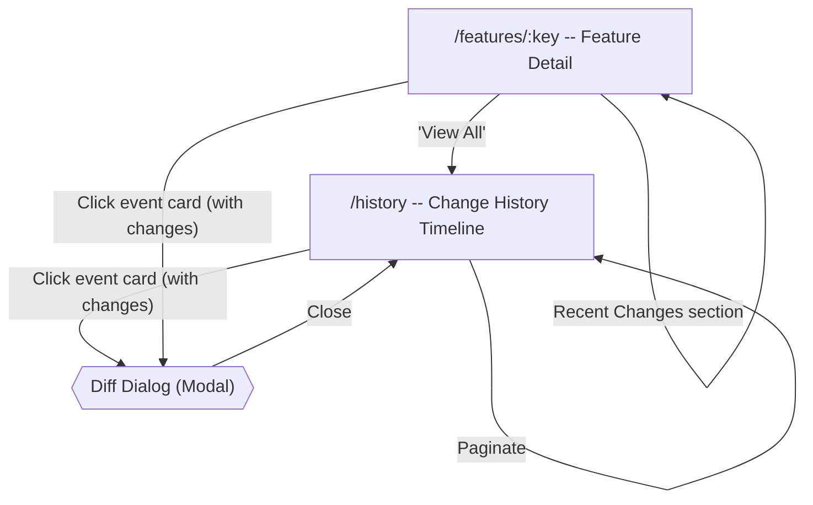

# Change History Flow

[< Back to Overview](../UI-FLOW.md)

---

## Flow Diagram

---

## Screens

### `/history` -- Change History Timeline

Full-page route. Displays a chronological timeline of all changes across features, rules, segments, and packs.

**Route**: `console/src/routes/_authenticated/history/index.tsx`

| Element | Type | Action |
|---|---|---|
| Page header | `PageHeader` | Title + description, no back arrow |
| Filters bar | `ChangeFilters` | 5-column grid of filter controls (see below) |
| Timeline | `ChangeTimeline` | List of `ChangeEventCard` components |
| Empty state | `EmptyState` | History icon + "no changes" message when list is empty |
| Pagination | Buttons | Previous / Next with page indicator ("Page X of Y") |

**Data**: Fetched via `changelogQueries.list(params)` with `useSuspenseQuery`. Returns `PaginatedResponse<ChangeEntry>`. Default: page 1, pageSize 20.

---

### Change Filters

**Component**: `console/src/components/history/change-filters.tsx`

Responsive grid layout: 1 column on mobile, 2 on sm, 5 on lg.

| Filter | Type | Options |
|---|---|---|
| Entity type | Select | All, Feature, Rule, Segment, Pack |
| Action | Select | All, Create, Update, Delete, Toggle, Reorder |
| Actor | Text input | Free-text filter by actor name/email |
| Date from | Date input | Start date filter |
| Date to | Date input | End date filter |

All filters reset pagination to page 1 on change. Entity type and action selects use `_all` sentinel value for the "show all" option.

---

### Change Event Card

**Component**: `console/src/components/history/change-event-card.tsx`

Each card is a full-width button element:

| Element | Type | Details |
|---|---|---|
| Action badge | `Badge` | Color-coded: `create`=success (green), `delete`=destructive (red), `update`/`toggle`=secondary (gray), other=outline |
| Entity type badge | `Badge variant="outline"` | Feature, Rule, Segment, Pack |
| Entity key | Text | Truncated, font-medium |
| Parent key | Text | Shown in parentheses if present (e.g., rule's parent feature key) |
| Actor | Text | Muted, xs size |
| Timestamp | Text | `toLocaleDateString()` + `toLocaleTimeString()` |
| "View diff" link | Text | Shown only when `fieldChanges` exists and has entries. Displays count |

Cards with `fieldChanges` are clickable (open diff dialog). Cards without changes have `disabled` cursor.

---

### Change Diff Dialog

**Component**: `console/src/components/history/change-diff-dialog.tsx`

Modal dialog showing field-by-field old vs new values.

| Element | Type | Details |
|---|---|---|
| Dialog title | Display | "Change Details" (i18n: `diff.title`) |
| Description | Display | Action type + entity type + entity key |
| Actor info | Display | Actor name + actor type badge + timestamp |
| Field changes list | Display | One card per changed field |
| Field name | `font-mono` | Field path (e.g., "name", "enabled", "expression") |
| Old value panel | Red background | `bg-red-50` / `dark:bg-red-950/20`. Shows old value as `<pre>` |
| New value panel | Green background | `bg-green-50` / `dark:bg-green-950/20`. Shows new value as `<pre>` |
| No changes text | Display | Shown when `fieldChanges` is empty |

Dialog is `max-w-2xl` with `max-h-[80vh]` scrollable content. Values are formatted as JSON for objects, "---" for null/undefined, or plain string otherwise.

---

## Feature Detail Integration

The feature detail page (`/features/:key`) includes a "Recent Changes" section at the bottom.

**Component**: `RecentChangesSection` in `console/src/routes/_authenticated/features/$featureKey/index.tsx`

| Element | Type | Action |
|---|---|---|
| Section heading | h2 | "Recent Changes" |
| "View All" link | Link | Navigates to `/history` |
| Timeline | `ChangeTimeline` | Shows last 10 changes for this feature (via `changelogQueries.byEntity`) |

Only rendered when there are entries. Uses `useQuery` (not suspense) so it loads asynchronously without blocking the page.

---

## Sidebar Navigation

| Label | Route | Icon | Position |
|---|---|---|---|
| Historial / History | `/history` | History (lucide) | Main nav, after Audit |

---

## API

**Base path**: `/admin/changelog`

| Endpoint | Method | Description |
|---|---|---|
| `/admin/changelog` | GET | List all changes with pagination + filters |
| `/admin/changelog/:entityType/:entityKey` | GET | List changes for a specific entity |

**Query parameters**: `page`, `pageSize`, `entityType`, `entityKey`, `actor`, `action`, `from`, `to`

**Response types**:
- `ChangeEntry`: `id`, `entityType`, `entityKey`, `parentKey?`, `action`, `actor`, `actorType`, `fieldChanges?` (array of `{field, oldValue, newValue}`), `metadata?`, `createdAt`

---

## i18n

**Namespace**: `history`
**Files**: `console/public/assets/locales/{es,en}/history.json`

Key groups:
- `title`, `description` -- page header
- `empty.title`, `empty.description` -- empty state
- `action.*` -- action labels (create, update, delete, toggle, reorder)
- `entityType.*` -- entity type labels (feature, rule, segment, pack)
- `filters.*` -- filter labels (entityType, action, actor, from, to, allEntities, allActions)
- `changes.viewDiff` -- "View N changes" link text
- `diff.*` -- diff dialog labels (title, by, old, new, noChanges)
- `recent.title`, `recent.viewAll` -- feature detail integration

---

## Component Files

| File | Purpose |
|---|---|
| `console/src/routes/_authenticated/history/index.tsx` | History page route |
| `console/src/components/history/change-timeline.tsx` | Timeline container, manages diff dialog selection |
| `console/src/components/history/change-event-card.tsx` | Individual event card with action/entity badges |
| `console/src/components/history/change-filters.tsx` | Filter controls (entity type, action, actor, date range) |
| `console/src/components/history/change-diff-dialog.tsx` | Diff viewer dialog with old/new value comparison |
| `console/src/api/changelog.ts` | API client for changelog endpoints |
| `console/src/queries/changelog-queries.ts` | TanStack Query factories |
