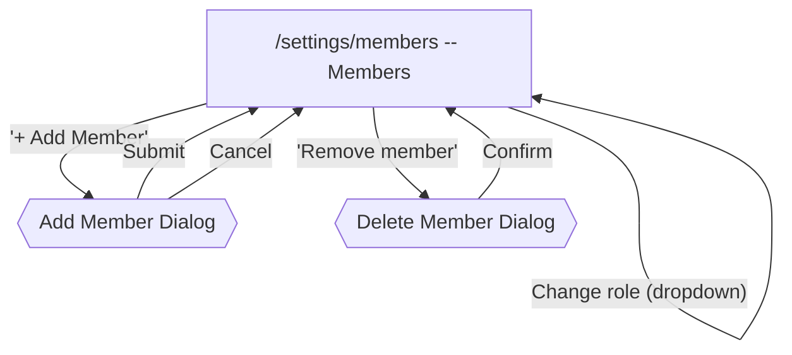

# Members Flow

[< Back to Overview](../UI-FLOW.md)

---

## Flow Diagram

---

## Screen: `/settings/members` -- Members

| Element                    | Type            | Action                                                                                         |
| -------------------------- | --------------- | ---------------------------------------------------------------------------------------------- |
| "+ Add Member" button      | Modal trigger   | Opens Add Member dialog (perm: `members.manage`)                                               |
| Member table: email + name | Display         |                                                                                                |
| Member table: role column  | Select or Badge | If canManage and not owner/self → `RoleSelect` (admin/editor/viewer). Otherwise → static badge |
| Member table: actions      | DropdownMenu    | "Remove member" (if canManage, not owner, not self)                                            |
| Owner row                  | Display         | Owner badge with shield icon, no actions                                                       |
| Empty state                | Display         |                                                                                                |

> **Mobile**: renders `MemberMobileCards`.

---

## Dialogs

### Add Member Dialog

| Element      | Type   | Action                                     |
| ------------ | ------ | ------------------------------------------ |
| Email input  | Field  | Required, email validation                 |
| Role select  | Select | `admin` / `editor` / `viewer` (no `owner`) |
| "Cancel"     | Close  | Closes dialog                              |
| "Add Member" | Submit | POST → closes on success                   |

### Delete Member Dialog

| Element           | Type     | Action          |
| ----------------- | -------- | --------------- |
| Confirmation text | Display  | "Are you sure?" |
| "Cancel"          | Close    | Closes dialog   |
| "Confirm"         | API call | DELETE member   |

---

## Owner Protection

- Last Owner cannot be deleted or demoted
- Self-demotion prevented for Owner
- Transfer ownership: POST `/admin/members/:id/transfer-ownership` (owner only)
