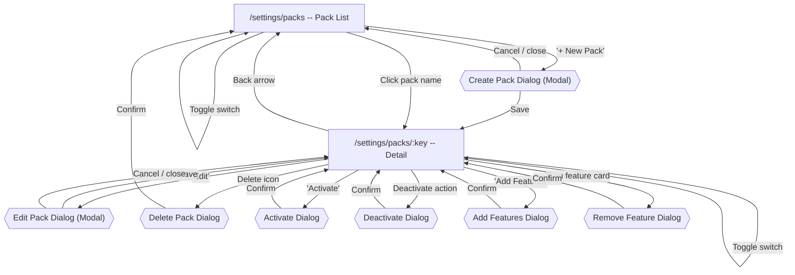

# Feature Packs Flow

[< Back to Overview](../UI-FLOW.md)

---

## Flow Diagram

---

## Screens

### `/settings/packs` -- Pack List

| Element                  | Type    | Action                                                  |
| ------------------------ | ------- | ------------------------------------------------------- |
| "+ New Pack" button      | Button  | Opens Create Pack modal dialog (perm: `features.write`) |
| Search input             | Filter  | Debounced text search, resets page                      |
| Pack name (row/card)     | Link    | → `/settings/packs/:key`                                |
| Key column               | Display | Monospace text                                          |
| Feature count badge      | Display | Badge showing number of features in pack                |
| Active activations count | Display | Badge showing active activations                        |
| Toggle switch (per row)  | API     | PATCH toggle enabled + optimistic UI                    |
| Actions menu             | Menu    | Edit, Delete (perm: `features.write`)                   |
| Pagination               | State   | Previous / Next                                         |
| Empty state CTA          | Button  | Opens Create Pack modal dialog                          |

**Desktop table columns:** Name, Key (mono), Features (count badge), Activations (count badge), Enabled (toggle), Actions.

> **Mobile**: renders `PackCard` list instead of table. Each card shows name, key (mono), feature count, activation count, and enabled toggle.

---

### Create Pack -- Modal Dialog

Create and Edit Pack use a **modal dialog** (`Dialog` component), not a separate route page. The dialog is opened from the pack list (create) or pack detail page (edit).

| Element          | Type      | Action                                                                         |
| ---------------- | --------- | ------------------------------------------------------------------------------ |
| Name input       | Field     | Required, max 256. Auto-slugs key on create                                    |
| Key input        | Field     | Monospace, regex-validated (`^[a-z0-9][a-z0-9\-_.]{1,127}$`), disabled on edit |
| Description      | Field     | Optional, max 1024                                                             |
| Feature selector | Component | Searchable dropdown with selected features as removable badges                 |
| "Cancel"         | Button    | Closes dialog                                                                  |
| "Save"           | Submit    | POST → navigates to `/settings/packs/:key`                                     |

> Dialog width: `sm:max-w-lg`. Name field auto-generates slug for key on create (user can override by editing key directly).

#### Feature Selector (inline on form)

| Element                  | Type    | Action                                                      |
| ------------------------ | ------- | ----------------------------------------------------------- |
| Search input             | Filter  | Instant search across all existing features                 |
| Feature dropdown results | List    | Shows matching features: name + key (mono). Click to select |
| Selected features badges | Display | Removable badges below input. Each badge: name + X button   |
| Empty results message    | Display | "No features found" when search has no matches              |

---

### `/settings/packs/:key` -- Pack Detail

This is the pack "command center". Two-tab layout with a detail header.

#### Header (`PackDetailHeader`)

| Element             | Type          | Action                                                |
| ------------------- | ------------- | ----------------------------------------------------- |
| Back arrow          | Navigate      | → `/settings/packs`                                   |
| Pack name + toggle  | Display + API | Toggle enabled                                        |
| Key (monospace)     | Display       |                                                       |
| Description         | Display       | Below key, muted text                                 |
| Feature count badge | Display       | e.g. "8 features"                                     |
| Activation summary  | Display       | e.g. "3 tenants, 5 campuses, 1 program"               |
| "Edit" button       | Button        | Opens Edit Pack modal dialog (perm: `features.write`) |
| Delete icon         | Modal         | Opens delete ConfirmDialog (perm: `features.write`)   |

#### Tab Bar

| Tab           | Label       | Content            |
| ------------- | ----------- | ------------------ |
| `features`    | Features    | Feature cards grid |
| `activations` | Activations | Activations table  |

Default tab: `features`. Tab state managed via component state.

---

#### Tab 1 -- Features

| Element                        | Type    | Action                                                      |
| ------------------------------ | ------- | ----------------------------------------------------------- |
| "Add Features" button          | Modal   | Opens Add Features Dialog (perm: `features.write`)          |
| Feature card grid              | Display | Responsive grid: 1 col mobile, 2 cols sm, 3 cols lg         |
| Feature card: name             | Display | Feature display name                                        |
| Feature card: key (mono)       | Display | Monospace, muted                                            |
| Feature card: enabled badge    | Display | Green "Enabled" / gray "Disabled"                           |
| Feature card: value type badge | Display | Secondary badge: boolean / string / number / json           |
| Feature card: X button         | Modal   | Opens Remove Feature ConfirmDialog (perm: `features.write`) |
| Empty state                    | Display | Icon + "No features in this pack yet" + "Add Features" CTA  |

> Cards use `rounded-lg border p-4` with hover elevation. Grid uses `gap-3`.

---

#### Tab 2 -- Activations

| Element                | Type    | Action                                                      |
| ---------------------- | ------- | ----------------------------------------------------------- |
| Activation summary bar | Display | Inline counts: "3 Tenants, 5 Campuses, 1 Program"           |
| "Activate" button      | Modal   | Opens Activate Dialog (perm: `features.write`)              |
| Activation table       | Table   | Desktop table layout                                        |
| Column: Target Type    | Display | Badge with distinct color per type (see below)              |
| Column: Target ID      | Display | Monospace text                                              |
| Column: Activated By   | Display | User name or email                                          |
| Column: Activated      | Display | Relative time ("2 days ago") with tooltip for absolute date |
| Column: Expires        | Display | Date or "Never" muted text                                  |
| Column: Actions        | Button  | "Deactivate" destructive ghost button                       |
| Empty state            | Display | Icon + "No activations yet" + "Activate" CTA                |

**Target type badge colors:**

| Type    | Badge variant | Color scheme                |
| ------- | ------------- | --------------------------- |
| Tenant  | `default`     | Primary (blue/indigo)       |
| Campus  | `secondary`   | Secondary (gray/slate)      |
| Program | `outline`     | Outlined with accent border |

> **Mobile**: renders `ActivationCard` list. Each card: target type badge, target ID, dates, deactivate button.

---

### Dialogs

#### Add Features Dialog

| Element              | Type    | Action                                                      |
| -------------------- | ------- | ----------------------------------------------------------- |
| Dialog title         | Display | "Add Features to Pack"                                      |
| Search input         | Filter  | Instant search across features not already in pack          |
| Feature results list | List    | Checkbox + name + key (mono) + value type badge. Scrollable |
| Selected count       | Display | "4 features selected" below search                          |
| "Cancel"             | Action  | Close dialog                                                |
| "Add Selected"       | Submit  | PATCH add features → refresh detail                         |

> Dialog uses `max-h-[60vh]` scrollable list. Features already in pack are excluded from results.

---

#### Remove Feature Dialog

| Element       | Type     | Action                                             |
| ------------- | -------- | -------------------------------------------------- |
| ConfirmDialog | Standard | "Remove `analytics.advanced` from this pack?"      |
| Description   | Display  | "This feature will no longer be part of the pack." |
| "Cancel"      | Action   | Close dialog                                       |
| "Remove"      | Submit   | PATCH remove feature → refresh detail              |

---

#### Activate Dialog

| Element              | Type      | Action                                                      |
| -------------------- | --------- | ----------------------------------------------------------- |
| Dialog title         | Display   | "Activate Pack"                                             |
| Target type          | Segmented | Inline button group: Tenant / Campus / Program (with icons) |
| Target ID input      | Field     | Label changes: "Tenant ID" / "Campus ID" / "Program ID"     |
| Expiration toggle    | Checkbox  | "Set expiration" (default: off)                             |
| Expiration date-time | Field     | `datetime-local` picker, shown only when checkbox checked   |
| "Cancel"             | Action    | Close dialog                                                |
| "Activate"           | Submit    | POST activation → refresh activations tab                   |

**Target type icons:**

| Type    | Icon (lucide) |
| ------- | ------------- |
| Tenant  | Building2     |
| Campus  | GraduationCap |
| Program | BookOpen      |

> Segmented control uses `inline-flex rounded-lg border` with active state `bg-primary text-primary-foreground`. Target ID input uses `font-mono`.

---

#### Deactivate Dialog

| Element       | Type                   | Action                                                           |
| ------------- | ---------------------- | ---------------------------------------------------------------- |
| ConfirmDialog | Standard (destructive) | "Deactivate premium-pack for campus campus-abc-123?"             |
| Description   | Display                | "All features in this pack will be deactivated for this target." |
| "Cancel"      | Action                 | Close dialog                                                     |
| "Deactivate"  | Submit                 | DELETE activation → refresh activations tab                      |

---

#### Delete Pack Dialog

| Element       | Type                   | Action                                           |
| ------------- | ---------------------- | ------------------------------------------------ |
| ConfirmDialog | Standard (destructive) | "Delete pack `premium-pack`?"                    |
| Description   | Display                | "This will remove the pack and all activations." |
| "Cancel"      | Action                 | Close dialog                                     |
| "Delete"      | Submit                 | DELETE → `/settings/packs`                       |

---

### Edit Pack -- Modal Dialog

Same modal dialog as Create. Key field is **disabled**. Feature selector shows current features pre-selected. Save → PATCH → refreshes pack detail.

---

## Component Reuse

| Shared Component   | Usage in Packs                                           |
| ------------------ | -------------------------------------------------------- |
| `EmptyState`       | Pack list, features tab, activations tab                 |
| `ConfirmDialog`    | Delete pack, remove feature, deactivate                  |
| `PermissionButton` | All write actions gated on `features.write`              |
| `Badge`            | Feature count, activation count, target type, value type |
| `useMobile`        | Card/table responsive switch                             |
| `PageHeader`       | Pack list page header                                    |

---

## Permission Gates

| Permission       | Gated Elements                                                                    |
| ---------------- | --------------------------------------------------------------------------------- |
| `features.write` | Create/edit/delete pack, toggle enabled, add/remove features, activate/deactivate |
