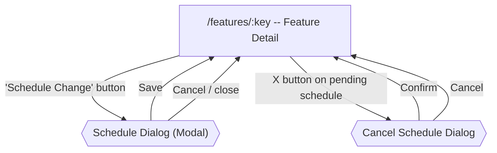

# Scheduled Rollouts Flow

[< Back to Overview](../UI-FLOW.md)

---

## Flow Diagram



---

## Overview

Scheduled rollouts allow admins to schedule future changes to a feature flag. This is not a standalone route -- it integrates into the feature detail page via a dialog and a pending schedules section.

---

## Integration Points

1. **Feature Detail Header** (`/features/:key`) -- "Schedule Change" button
2. **Pending Schedules Section** -- shown on feature detail page above the rules section

---

## Feature Detail Header -- Schedule Button

**Component**: `console/src/components/features/feature-detail-header.tsx`

| Element | Type | Action |
|---|---|---|
| "Schedule Change" button | `PermissionButton` | Permission: `features.write`. Calendar icon. Opens `ScheduleDialog` |

The button is positioned in the header action bar alongside Edit and Delete buttons.

---

## Schedule Dialog

**Component**: `console/src/components/schedules/schedule-dialog.tsx`

Modal dialog (`sm:max-w-md`) for creating a new scheduled change.

| Element | Type | Details |
|---|---|---|
| Dialog title | Display | i18n: `form.title` |
| Dialog description | Display | i18n: `form.description` |
| Change type select | Select | Options: Toggle, Default Value, Environment |
| Payload fields | Dynamic | Shown based on selected change type (see below) |
| Scheduled date/time | `datetime-local` input | Required. Must be in the future |
| Helper text | Display | i18n: `form.scheduledAtHelper` |
| "Cancel" button | Button | Closes dialog |
| "Schedule Change" button | Submit | Creates schedule via API |

### Change Type-Specific Fields

| Change Type | Field | Type | Details |
|---|---|---|---|
| `toggle` | Toggle value | Select | "Enable" (`true`) or "Disable" (`false`). Default: opposite of current `feature.enabled` |
| `default_value` | New default value | Input | Monospace text input for the new default value |
| `environment` | (no additional fields) | -- | Payload is empty for environment changes |

### Validation

- **Zod schema**: `changeType` (enum: toggle, default_value, environment), `scheduledAt` (required string), `toggleValue` (optional boolean), `defaultValue` (optional string)
- **Runtime check**: `scheduledAt` must be in the future (`new Date(data.scheduledAt) > new Date()`). If not, shows toast error

### API Payload

```
POST /features/admin/features/:featureKey/schedules
{
  changeType: "toggle" | "default_value" | "environment",
  payload: { enabled: boolean } | { defaultValue: string } | {},
  scheduledAt: "ISO-8601 string"
}
```

---

## Pending Schedules Section

**Component**: `console/src/components/schedules/pending-schedules.tsx` (`PendingSchedules`)

Positioned on the feature detail page between the metadata section and the rules section.

**Visibility**: Only rendered when there are active schedules (status `pending` or `executing`). Hidden when empty.

| Element | Type | Details |
|---|---|---|
| Section heading | h2 | "Scheduled Changes" with count badge |
| Schedule card list | Cards | One `ScheduleCard` per active schedule |

### Schedule Card

**Component**: `ScheduleCard` (internal to `pending-schedules.tsx`)

| Element | Type | Details |
|---|---|---|
| Clock icon | Icon | Muted, left-aligned |
| Change type label | Text | Translated change type (toggle, default_value, environment) |
| Status badge | `Badge` | Color-coded: `pending`=warning (yellow), `completed`=success (green), `failed`=destructive (red), other=secondary |
| Countdown | Text | Monospace. "in Xd Xh Xm". Only shown for `pending` status. Updates every 60 seconds |
| Scheduled date | Text | "Scheduled for [date]" -- formatted as "Mon DD, HH:MM" |
| Created by | Text | "by [actor name]" |
| Cancel button | Button (ghost, destructive) | X icon. Only shown for `pending` schedules. Opens cancel confirm dialog |

### Live Countdown

The countdown timer recalculates every 60 seconds via `setInterval`. Format:
- Days + hours + minutes (e.g., "2d 5h 30m")
- "< 1m" when less than 1 minute remaining
- Only days/hours/minutes with non-zero values are shown

---

### Dialogs

#### Cancel Schedule Dialog

Standard `ConfirmDialog` (destructive variant):
- Triggered by X button on a pending schedule card
- Confirm triggers `DELETE /features/admin/schedules/:id`
- Toast on success/error

---

## API

| Endpoint | Method | Description |
|---|---|---|
| `/features/admin/features/:featureKey/schedules` | GET | List schedules for a feature |
| `/features/admin/features/:featureKey/schedules` | POST | Create a scheduled change |
| `/features/admin/schedules/:id` | DELETE | Cancel a scheduled change |

**Types**:
- `ScheduledChange`: `id`, `workspaceKey`, `featureKey`, `changeType`, `payload`, `scheduledAt`, `status`, `error?`, `executedAt?`, `createdBy`, `createdAt`
- `ScheduleStatus`: `pending` | `executing` | `completed` | `failed` | `cancelled`
- `ChangeType`: `toggle` | `update` | `default_value` | `environment`

---

## i18n

**Namespace**: `schedules`
**Files**: `console/public/assets/locales/{es,en}/schedules.json`

Key groups:
- `title` -- section heading ("Scheduled Changes")
- `scheduleChange` -- button label
- `scheduledFor`, `scheduledBy` -- card text
- `countdown.in` -- "in" prefix for countdown
- `changeTypes.*` -- toggle, default_value, environment labels
- `status.*` -- pending, executing, completed, failed, cancelled labels
- `form.*` -- dialog fields (title, description, changeType, payload, scheduledAt, scheduledAtHelper, dateFuture, dateRequired, toggleEnable, toggleDisable, newDefaultValue, success, error)
- `cancel.*` -- cancel dialog (title, description, success, error)

---

## Permission Gates

| Permission | Gated Elements |
|---|---|
| `features.write` | "Schedule Change" button in feature detail header |

---

## Component Files

| File | Purpose |
|---|---|
| `console/src/components/schedules/schedule-dialog.tsx` | Schedule creation dialog with change type selector |
| `console/src/components/schedules/pending-schedules.tsx` | Pending schedules section + individual schedule cards |
| `console/src/components/features/feature-detail-header.tsx` | Integrates "Schedule Change" button |
| `console/src/routes/_authenticated/features/$featureKey/index.tsx` | Integrates `PendingSchedules` section on detail page |
| `console/src/api/schedules.ts` | Schedules API client module |
| `console/src/queries/schedule-queries.ts` | TanStack Query factories |
| `console/src/mutations/schedule-mutations.ts` | TanStack Query mutations (create, cancel) |
