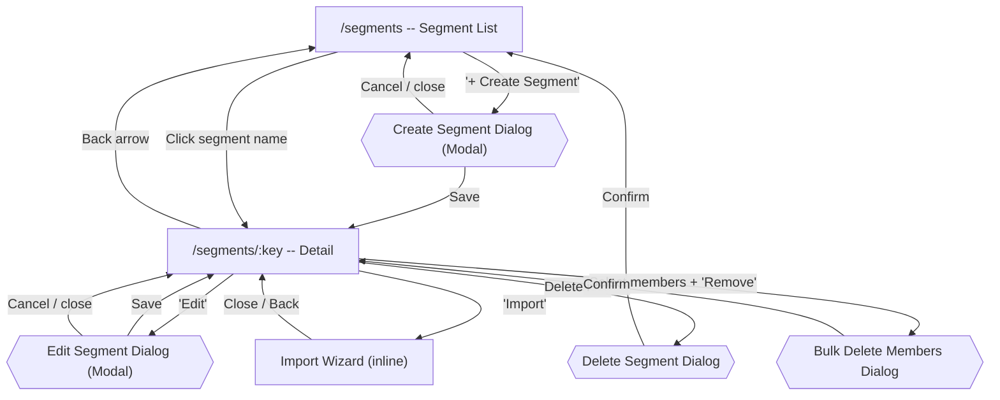
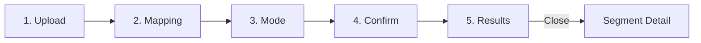

# Segments Flow

[< Back to Overview](../UI-FLOW.md)

---

## Flow Diagram

---

## Screens

### `/segments` -- Segment List

| Element                   | Type   | Action                                                     |
| ------------------------- | ------ | ---------------------------------------------------------- |
| "+ Create Segment" button | Button | Opens Create Segment modal dialog (perm: `segments.write`) |
| Search input              | Filter | Text search, resets page                                   |
| Segment name (row/card)   | Link   | → `/segments/:key`                                         |
| Pagination                | State  | Previous / Next                                            |
| Empty state CTA           | Button | Opens Create Segment modal dialog                          |

> **Mobile**: renders `SegmentCard` list.

---

### Create Segment -- Modal Dialog

Create and Edit Segment use a **modal dialog** (`Dialog` component), not a separate route page. The dialog is opened from the segment list (create) or segment detail (edit).

| Element     | Type   | Action                               |
| ----------- | ------ | ------------------------------------ |
| Key input   | Field  | Monospace, regex-validated, required |
| Name input  | Field  | Required                             |
| Description | Field  | Optional                             |
| "Cancel"    | Button | Closes dialog                        |
| "Save"      | Submit | POST → navigates to `/segments/:key` |

> Dialog width: `sm:max-w-md`

---

### `/segments/:key` -- Segment Detail

#### Header (`SegmentDetailHeader`)

| Element         | Type     | Action                                                   |
| --------------- | -------- | -------------------------------------------------------- |
| Back arrow      | Navigate | → `/segments`                                            |
| Segment name    | Display  | Bold, 2xl                                                |
| Key (monospace) | Display  | Muted, mono text                                         |
| "Import" button | Button   | Opens import wizard inline (perm: `segments.write`)      |
| "Edit" button   | Button   | Opens Edit Segment modal dialog (perm: `segments.write`) |
| Delete icon     | Button   | Opens delete ConfirmDialog (perm: `segments.write`)      |

#### Members Section

| Element                  | Type      | Action                                            |
| ------------------------ | --------- | ------------------------------------------------- |
| Members heading          | Display   |                                                   |
| Member filters: userId   | Filter    | Filter by userId                                  |
| Member filters: tenantId | Filter    | Filter by tenantId                                |
| Select-all checkbox      | Selection | Toggles all visible                               |
| Row checkbox             | Selection | Toggles individual                                |
| Bulk "Remove" button     | Modal     | Opens bulk delete dialog (perm: `segments.write`) |
| Pagination               | State     | Server-side, Previous / Next                      |
| Empty members state      | Display   |                                                   |

### Dialogs

| Dialog              | Trigger               | Action                            |
| ------------------- | --------------------- | --------------------------------- |
| Edit Segment        | Edit button on header | Modal dialog → PATCH on save      |
| Delete Segment      | Trash icon on header  | Confirm → DELETE → `/segments`    |
| Bulk Delete Members | "Remove" in bulk bar  | Confirm → DELETE selected members |

---

### Edit Segment -- Modal Dialog

Same modal dialog as Create. Key field **disabled**. Save → PATCH → refreshes segment detail.

---

### Import Wizard (inline on Segment Detail)

Replaces segment detail view. 5 steps:

| Step       | Screen        | Elements                                                                                                                           |
| ---------- | ------------- | ---------------------------------------------------------------------------------------------------------------------------------- |
| 1. Upload  | `StepUpload`  | Drag&drop CSV or textarea paste. Web Worker parsing. CSV Format guide box (column descriptions + example). "Next"                  |
| 2. Mapping | `StepMapping` | Map columns → fields (userId, tenantId, attributes, expiresAt, skip). Preview 50 rows. Summary: X valid, Y errors. "Back" / "Next" |
| 3. Mode    | `StepMode`    | Select: Merge (append) or Replace (with warning). "Back" / "Next"                                                                  |
| 4. Confirm | `StepConfirm` | Review summary: mode, valid count, error count. "Back" / "Import"                                                                  |
| 5. Results | `StepResults` | Inserted/updated/errors. Download error report CSV. "Close"                                                                        |

Back arrow at top returns to segment detail at any step.

#### Upload Step CSV Guide

The upload step includes a bordered info box with:

- Title: "CSV Format"
- Column descriptions: userId (required), tenantId, attributes (JSON), expiresAt (ISO date)
- Example CSV data in a `<pre>` block

> **Replace mode warning**: Non-atomic. If fails mid-import, segment may be partial.
