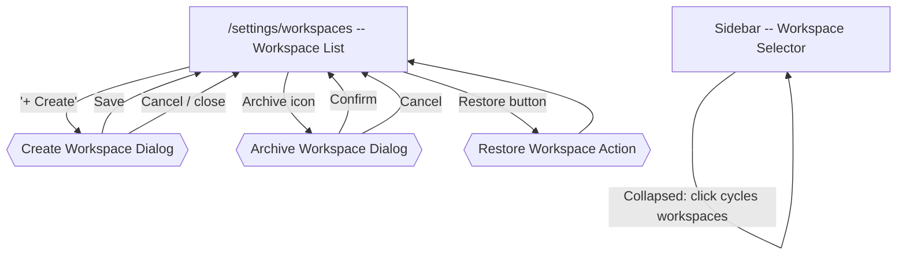

# Multi-Workspace Flow

[< Back to Overview](../UI-FLOW.md)

---

## Flow Diagram

---

## Architecture

Workspaces provide logical isolation of all data. The active workspace is tracked globally and sent with every API request.

### State Management

**Zustand store**: `console/src/stores/workspace-store.ts` (`useWorkspaceStore`)

| State | Type | Details |
|---|---|---|
| `workspaceKey` | `string` | Current active workspace key. Defaults to `'default'` |
| `setWorkspace(key)` | Function | Sets key, persists to `localStorage` (`fe-workspace`), clears all TanStack Query cache (`queryClient.clear()`) |

**Non-reactive accessor**: `getWorkspaceKey()` -- used by the API client outside React.

### API Client Integration

**File**: `console/src/api/client.ts`

Every API request includes the `X-Workspace` header set to the current workspace key via `getWorkspaceKey()`. This ensures all data operations are scoped to the active workspace.

### Cache Isolation

When a workspace switch occurs:
1. `localStorage` is updated with the new workspace key
2. `queryClient.clear()` wipes all cached queries
3. All components re-fetch data for the new workspace context

---

## Screens

### Sidebar -- Workspace Selector

**Component**: `console/src/components/layout/workspace-selector.tsx`

Positioned in the sidebar between the app title and the navigation links.

| State | Behavior |
|---|---|
| Only 1 workspace | Selector is hidden (returns `null`) |
| Sidebar expanded | Full `Select` dropdown showing all workspace names |
| Sidebar collapsed | Icon button (`ChevronsUpDown`) that cycles through workspaces on click |

| Element | Type | Action |
|---|---|---|
| Select dropdown | `Select` | Shows all workspaces by name. Change triggers `setWorkspace()` |
| Collapsed button | Button | Cycles to next workspace in list order |

---

### `/settings/workspaces` -- Workspace Settings Page

**Route**: `console/src/routes/_authenticated/settings/workspaces.tsx`

| Element | Type | Action |
|---|---|---|
| Page header | `PageHeader` | Title + description + "+ Create" action button |
| "+ Create" button | `PermissionButton` | Permission: `settings.manage`. Opens create dialog |
| Workspace list | Sectioned card list | Active and archived workspaces rendered separately |
| Empty state | `EmptyState` | Building2 icon + message when no workspaces |

#### Workspace Card

| Element | Type | Details |
|---|---|---|
| Name | Text | `font-medium` |
| Key | `Badge variant="outline"` | Monospace text |
| "Current" badge | `Badge variant="success"` | Shown only for the active workspace |
| Description | Text | Muted, below name row |
| Archive button | `PermissionButton` | Archive icon. Permission: `workspace.delete` |
| Restore button | `PermissionButton` | Shown on archived workspaces. Permission: `workspace.delete` |

---

### Create Workspace Dialog

**Component**: `console/src/components/workspaces/workspace-form-dialog.tsx`

Modal dialog (`sm:max-w-lg`) used by the current screen for workspace creation. The component is also compatible with update payloads, but the settings page currently exposes create/archive/restore actions only.

| Element | Type | Validation | Details |
|---|---|---|---|
| Name input | Field | Required, min 1, max 256 | Auto-generates slug for key on create |
| Key input | Field | Required, min 2, max 128, regex `^[a-z0-9][a-z0-9\-_.]{1,127}$` | Monospace. Disabled on edit. Auto-slug stops when user manually edits key |
| Key pattern hint | Text | -- | Muted helper text explaining key format |
| Description input | Field | Optional | Max 1024 |
| "Cancel" button | Button | -- | Closes dialog |
| "Save" button | Submit | -- | POST (create) or PUT (edit) |

**Auto-slug behavior**: When creating, typing in the name field auto-generates a slug in the key field. If the user manually edits the key, auto-slug is disabled for the rest of the session.

**Slug function**: Lowercase, replace non-alphanumeric with hyphens, trim leading/trailing hyphens, limit to 128 chars.

---

### Dialogs

#### Archive Workspace Dialog

Standard `ConfirmDialog` (destructive variant):
- Title: "Archive workspace"
- Description: Includes workspace name
- Confirm triggers `POST /features/admin/workspaces/:key/archive`

#### Restore Workspace Action

- Triggered by the restore button in the archived section
- Calls `POST /features/admin/workspaces/:key/restore`
- On success, the restored workspace becomes the active workspace in the client store

---

## Sidebar Navigation

| Label | Route | Icon | Position |
|---|---|---|---|
| Workspaces | `/settings/workspaces` | Building2 (lucide) | Settings section, after Packs |

---

## API

**Base path**: `/features/admin/workspaces`

| Endpoint | Method | Description |
|---|---|---|
| `/features/admin/workspaces` | GET | List all workspaces (`includeArchived=true` supported) |
| `/features/admin/workspaces/:key` | GET | Get workspace by key |
| `/features/admin/workspaces` | POST | Create workspace |
| `/features/admin/workspaces/:key` | PUT | Update workspace |
| `/features/admin/workspaces/:key/archive` | POST | Archive workspace |
| `/features/admin/workspaces/:key/restore` | POST | Restore workspace |
| `/features/admin/workspaces/:key` | DELETE | Backward-compatible archive alias |

**Types**:
- `Workspace`: `id`, `key`, `name`, `description`, `metadata?`, `createdAt`, `updatedAt`, `createdBy`
- `CreateWorkspaceRequest`: `key`, `name`, `description?`
- `UpdateWorkspaceRequest`: `name`, `description?`

---

## i18n

**Namespace**: `workspaces`
**Files**: `console/public/assets/locales/{es,en}/workspaces.json`

Key groups:
- `title`, `description` -- page header
- `create` -- create button label
- `current` -- "Current" badge text
- `empty.title`, `empty.description` -- empty state
- `selector.switch`, `selector.placeholder` -- sidebar selector
- `fields.name`, `fields.key`, `fields.description` -- form field labels
- `form.createTitle`, `form.editTitle`, `form.createDescription`, `form.editDescription` -- dialog header
- `form.success`, `form.error` -- toast messages
- `form.nameRequired`, `form.keyInvalid`, `form.keyPattern` -- validation messages
- `archive.title`, `archive.description`, `archive.success`, `archive.error` -- archive dialog
- `restore.action`, `restore.success`, `restore.error` -- restore button + toast

---

## Permission Gates

| Permission | Gated Elements |
|---|---|
| `settings.manage` | Create workspace button |
| `workspace.delete` | Archive and restore workspace actions |

---

## Component Files

| File | Purpose |
|---|---|
| `console/src/components/layout/workspace-selector.tsx` | Sidebar workspace switcher (select or cycle button) |
| `console/src/components/layout/app-sidebar.tsx` | Integrates `WorkspaceSelector` into sidebar |
| `console/src/routes/_authenticated/settings/workspaces.tsx` | Workspace settings page |
| `console/src/components/workspaces/workspace-form-dialog.tsx` | Workspace form dialog used by the current create flow |
| `console/src/stores/workspace-store.ts` | Zustand store for workspace state + localStorage persistence |
| `console/src/api/client.ts` | API client with `X-Workspace` header injection |
| `console/src/api/workspaces.ts` | Workspace API client module |
| `console/src/queries/workspace-queries.ts` | TanStack Query factories |
| `console/src/mutations/workspace-mutations.ts` | TanStack Query mutations |
